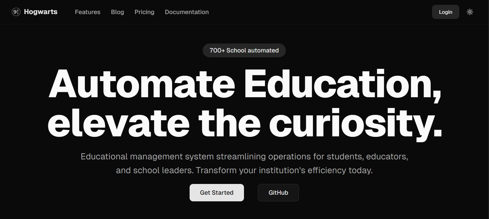

# Hogwarts

Hogwarts is a school automation platform that manages students, faculty, and academic processes with an intuitive interface.

## Stack

## Documentation

Visit https://ed.databayt.org/docs to view the full documentation.

## Contributing

Please read the [contributing guide](/CONTRIBUTING.md).

## License

Licensed under the [MIT license](https://github.com/shadcn/ui/blob/main/LICENSE.md).
