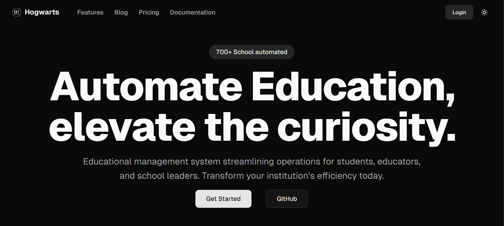
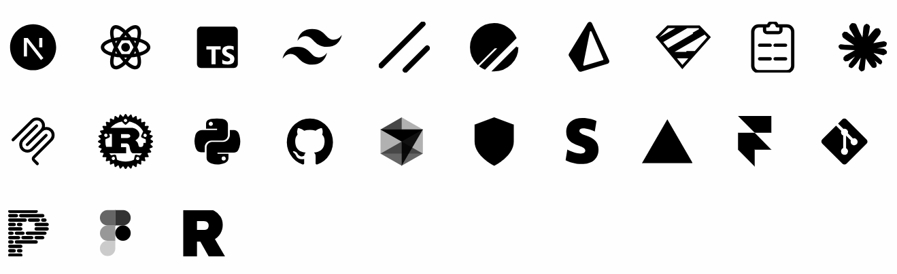

# Hogwarts

Hogwarts is a school automation platform that manages students, faculty, and academic processes with an intuitive interface.

## Stack

## Documentation

Visit https://ed.databayt.org/docs to view the full documentation.

## Contributing

Please read the [contributing guide](/CONTRIBUTING.md).

## License

Licensed under the [Server Side Public License v1 (SSPL-1.0)](./LICENSE).

- **Self-hosting** for your own school or organization is permitted at no cost.
- **Offering as a SaaS** to third parties requires a [commercial license](./LICENSING.md).
- Contact **licensing@databayt.org** for commercial licensing.

Some components (shadcn/ui, Radix UI) are MIT-licensed. See [NOTICE](./NOTICE) for third-party attributions.

"Hogwarts" and "databayt" are trademarks. Forks must remove all branding. See [TRADEMARKS.md](./TRADEMARKS.md).
