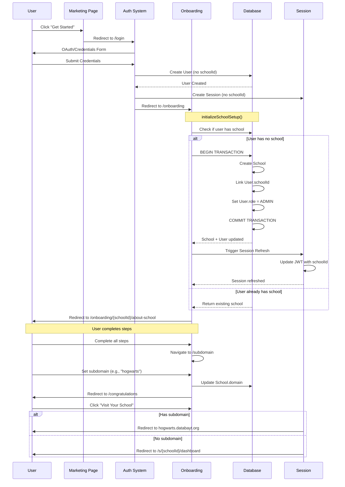

## Overview

The **Onboarding System** is a multi-step wizard that guides new schools through platform registration, configuration, and business setup. It follows the mirror pattern and spans **166 files** across **16 steps** organized into **3 groups**.

**Purpose:**

- **School Administrators**: Complete school profile setup in 15-30 minutes
- **Developers**: Understand the flow, auth integration, and multi-tenant architecture
- **Platform**: Ensure data quality and compliance before schools go live

**Completion Time:**

| Scope                             | Time          |
| --------------------------------- | ------------- |
| Basic Setup (required steps only) | 10-15 minutes |
| Full Setup (all steps)            | 20-30 minutes |
| With Data Import                  | 30-45 minutes |

---

## Architecture

The onboarding system is **100% consolidated** into two directories following the mirror pattern, plus 3 API routes.

### Directory Tree

```
src/
├── app/[lang]/onboarding/                       # Routes (21 files)
│   ├── page.tsx                                 # Landing page
│   ├── overview/page.tsx                        # School list dashboard
│   └── [id]/                                    # Dynamic school routes
│       ├── layout.tsx                           # ListingProvider + validation
│       ├── route-handler.ts                     # Route utilities
│       ├── about-school/page.tsx
│       ├── title/page.tsx
│       ├── description/page.tsx
│       ├── location/page.tsx
│       ├── stand-out/page.tsx
│       ├── capacity/page.tsx
│       ├── branding/page.tsx
│       ├── import/page.tsx
│       ├── finish-setup/page.tsx
│       ├── join/page.tsx
│       ├── visibility/page.tsx
│       ├── price/page.tsx
│       ├── discount/page.tsx
│       ├── legal/page.tsx
│       ├── subdomain/page.tsx
│       └── congratulations/page.tsx
│
├── app/api/onboarding/                          # API routes (3 endpoints)
│   ├── create-school/route.ts                   # Atomic school creation
│   ├── validate-access/route.ts                 # Pre-flight access check
│   └── extract/route.ts                         # AI document extraction
│
└── components/onboarding/                       # Components (145 files)
    │
    │ # Core files
    ├── index.ts                                 # Barrel exports
    ├── actions.ts                               # Server actions (CRUD)
    ├── auth.ts                                  # Authentication utilities
    ├── auth-helpers.ts                          # getAuthContext, requireSchoolOwnership
    ├── config.ts                                # Step configurations (ONBOARDING_STEPS)
    ├── config.client.ts                         # Client-side config
    ├── constants.client.ts                      # Client constants (⚠️ stale STEP_NAVIGATION)
    ├── types.ts                                 # OnboardingStep, OnboardingSchoolData
    ├── validation.ts                            # Root Zod schemas
    ├── validation-utils.ts                      # Validation helpers
    ├── util.ts                                  # General utilities
    │
    │ # State & hooks
    ├── use-listing.tsx                          # ListingProvider context
    ├── use-onboarding.ts                        # Navigation & validation
    ├── use-user-schools.tsx                     # User schools hook
    ├── with-school-context.tsx                  # HOC for school context
    │
    │ # Layout components
    ├── host-validation-context.tsx              # ⚠️ Deprecated: re-exports from form block
    ├── host-header.tsx                          # Progress indicator
    ├── host-step-header.tsx                     # Step header
    ├── host-step-layout.tsx                     # Step layout wrapper
    ├── step-header.tsx                          # Generic step header
    ├── step-navigation.tsx                      # Navigation controls
    ├── step-title.tsx                           # Step title component
    ├── step-wrapper.tsx                         # Step wrapper
    │
    │ # UI components
    ├── card.tsx                                 # Card layout
    ├── column.tsx / column-layout.tsx           # Column utilities
    ├── content.tsx                              # Content wrapper
    ├── detail.tsx                               # Detail view
    ├── all.tsx                                  # All items view
    ├── form.tsx / form-field.tsx                # Form components
    ├── selection-card.tsx                       # Selection card
    ├── progress-indicator.tsx                   # Progress bar
    ├── error-boundary.tsx                       # Error boundary
    ├── performance-monitor.ts                   # Performance tracking
    ├── success-completion-modal.tsx             # Success modal
    │
    │ # Step subdirectories (16 + overview + newcomers + floor-plan)
    ├── about-school/                            # 7 files
    ├── title/                                   # 8 files
    ├── description/                             # 9 files
    ├── location/                                # 9 files
    ├── stand-out/                               # 7 files
    ├── capacity/                                # 9 files
    ├── schedule/                                # 5 files (in type, excluded from nav)
    ├── branding/                                # 8 files
    ├── import/                                  # 7 files
    ├── finish-setup/                            # 7 files
    ├── join/                                    # 5 files
    ├── visibility/                              # 4 files
    ├── price/                                   # 8 files
    ├── discount/                                # 4 files
    ├── legal/                                   # 5 files
    ├── subdomain/                               # 7 files
    ├── congratulations/                         # 2 files
    ├── overview/                                # 5 files (dashboard)
    ├── newcomers/                               # Modal flow for joining members
    │   ├── config.ts / validation.ts / actions.ts
    │   ├── newcomers-modal.tsx
    │   └── steps/ (role, info, verify, profile, welcome)
    └── floor-plan/                              # 1 file (validation only)
```

### File Statistics

| Category         | Count                    |
| ---------------- | ------------------------ |
| Route files      | 21                       |
| API route files  | 3                        |
| Component files  | 145                      |
| Step directories | 17 (16 steps + overview) |
| **Total**        | **~169 files**           |

### Step Directory Pattern

Each step follows a consistent structure:

```
[step-name]/
├── actions.ts          # Server actions ("use server")
├── card.tsx            # Card UI component
├── config.ts           # Step configuration (STEP_NAME_STEP constant)
├── content.tsx         # Main content (server component)
├── form.tsx            # Form implementation (client)
├── types.ts            # Type definitions
├── validation.ts       # Zod schemas
└── use-[step].tsx      # Optional custom hook
```

---

## Complete Flow

The onboarding flow consists of **16 steps** in the `OnboardingStep` type, but only **15 are active** in the navigation config (schedule is defined but excluded).

### Group 1: Basic Information

| Step             | Path            | Required | Key Fields                    | Database                                       |
| ---------------- | --------------- | -------- | ----------------------------- | ---------------------------------------------- |
| **About School** | `/about-school` | No       | N/A (static welcome)          | N/A                                            |
| **Title**        | `/title`        | Yes      | School name                   | `School.name`                                  |
| **Description**  | `/description`  | Yes      | Type, level, description      | `School.schoolType`, `schoolLevel`, `planType` |
| **Location**     | `/location`     | Yes      | Address, city, state, country | `School.address`, `city`, `state`, `country`   |
| **Stand Out**    | `/stand-out`    | No       | Unique features (static)      | N/A                                            |

### Group 2: School Setup

| Step             | Path            | Required | Key Fields                                 | Database                                          |
| ---------------- | --------------- | -------- | ------------------------------------------ | ------------------------------------------------- |
| **Capacity**     | `/capacity`     | Yes      | maxStudents, maxTeachers, maxClasses       | `School.maxStudents`, `maxTeachers`, `maxClasses` |
| **Schedule**     | -               | No       | Timetable structure                        | `School` (not in active nav)                      |
| **Branding**     | `/branding`     | No       | Logo, primary color, border radius, shadow | `School.primaryColor`, `borderRadius`, `shadow`   |
| **Import**       | `/import`       | No       | CSV/Excel upload                           | Bulk insert                                       |
| **Finish Setup** | `/finish-setup` | No       | Review (static)                            | N/A                                               |

> **Note:** The `schedule` step exists in the `OnboardingStep` type and has a component directory (`components/onboarding/schedule/`) with actions, validation, and UI. However, it is **not included** in the active `ONBOARDING_CONFIG.steps` array in `src/components/form/footer.tsx`, so users do not navigate to it during the flow. It is available at `order: 5.5` in `config.ts` for future activation.

### Group 3: Business & Legal

| Step           | Path          | Required | Key Fields                        | Database                                                                                |
| -------------- | ------------- | -------- | --------------------------------- | --------------------------------------------------------------------------------------- |
| **Join**       | `/join`       | Yes      | Registration data                 | `User`                                                                                  |
| **Visibility** | `/visibility` | No       | Public/private settings           | `School.isPublished`                                                                    |
| **Price**      | `/price`      | Yes      | Tuition, fees, currency, schedule | `School.tuitionFee`, `registrationFee`, `applicationFee`, `currency`, `paymentSchedule` |
| **Discount**   | `/discount`   | No       | Promo codes                       | `Discount` model                                                                        |
| **Legal**      | `/legal`      | Yes      | Terms acceptance                  | `LegalConsent`                                                                          |
| **Subdomain**  | `/subdomain`  | No       | Custom domain                     | `School.domain`                                                                         |

After all steps: **Congratulations** page at `/congratulations` with smart redirect.

### Active Navigation Config

The actual step order is defined in `src/components/form/footer.tsx`:

```typescript
export const ONBOARDING_CONFIG: StepConfig = {
  steps: [
    "about-school",
    "title",
    "description",
    "location",
    "stand-out",
    "capacity",
    "branding",
    "import",
    "finish-setup",
    "join",
    "visibility",
    "price",
    "discount",
    "legal",
    "subdomain",
  ],
  groups: {
    1: ["about-school", "title", "description", "location", "stand-out"],
    2: ["capacity", "branding", "import", "finish-setup"],
    3: ["join", "visibility", "price", "discount", "legal", "subdomain"],
  },
  groupLabels: [
    "Tell us about your school",
    "Set up your school",
    "Finish up and publish",
  ],
}
```

### Newcomers Flow (Separate)

The `newcomers/` subdirectory contains a **separate modal flow** for internal school members (teachers, staff, parents, students) joining an existing school. It has 5 steps: role → info → verify → profile → welcome.

---

## Auth Integration

### Complete Authentication Flow



### Atomic School Creation

`initializeSchoolSetup()` delegates to `ensureUserSchool()` in `src/lib/school-access.ts`, which uses Prisma transactions:

```typescript
export async function ensureUserSchool(userId: string) {
  return await db.$transaction(async (tx) => {
    // 1. Check if user already has a school (idempotent)
    const user = await tx.user.findUnique({
      where: { id: userId },
      select: { schoolId: true },
    })

    if (user?.schoolId) {
      const school = await tx.school.findUnique({
        where: { id: user.schoolId },
      })
      return { success: true, schoolId: user.schoolId, school }
    }

    // 2. Create school + link user atomically
    const school = await tx.school.create({
      data: {
        name: "New School",
        domain: `school-${Date.now()}`,
        createdByUserId: userId,
      },
    })

    await tx.user.update({
      where: { id: userId },
      data: { schoolId: school.id, role: "ADMIN" },
    })

    return { success: true, schoolId: school.id, school }
  })
}
```

**Key properties:**

- **Atomicity**: School creation and user linking in a single transaction
- **Idempotency**: Safe to call multiple times (returns existing school)
- **Race condition handling**: Transaction isolation prevents duplicate schools

### Session Refresh

After school creation, the client must refresh the session to get the new `schoolId` in the JWT:

```typescript
const result = await initializeSchoolSetup()

if (result.success && result.data._sessionRefreshRequired) {
  await fetch("/api/auth/session", { method: "GET" })
  router.push(result.data._redirect)
}
```

### Smart Redirect

After completing onboarding, the system redirects based on subdomain:

- **Has subdomain**: `https://{domain}.databayt.org`
- **No subdomain**: `/s/{schoolId}/dashboard`

---

## Multi-Tenant Integration

### Subdomain Routing

```
Production:    hogwarts.databayt.org → /[lang]/s/hogwarts/*
Preview:       hogwarts---branch.vercel.app → /[lang]/s/hogwarts/*
Development:   hogwarts.localhost:3000 → /[lang]/s/hogwarts/*
```

### Database Scoping

All business models include `schoolId` with `@@index([schoolId])` and uniqueness constraints scoped by schoolId. The `School` model uses its `id` as the primary key, with `domain` as a unique optional field.

### Ownership Verification

All server actions verify ownership before mutations:

```typescript
import { requireSchoolOwnership } from "./auth-helpers"

export async function updateListing(id: string, data: Partial<Listing>) {
  await requireSchoolOwnership(id) // Throws if user doesn't own this school
  await db.school.update({ where: { id }, data })
}
```

---

## Validation System

### Factory Pattern

Step schemas use factory functions that accept a dictionary for i18n:

```typescript
// src/components/onboarding/validation.ts
import { getValidationMessages } from "@/components/internationalization/helpers"

export function createTitleStepValidation(dictionary: Dictionary) {
  const v = getValidationMessages(dictionary)
  return z
    .object({
      name: z
        .string()
        .min(2, { message: v.minLength(2) })
        .max(100, { message: v.maxLength(100) })
        .trim(),
    })
    .required({ name: true })
}
```

### Step Schemas

| Step        | Schema                      | Required Fields                                        |
| ----------- | --------------------------- | ------------------------------------------------------ |
| Title       | `titleStepValidation`       | name                                                   |
| Description | `descriptionStepValidation` | description, schoolLevel, schoolType                   |
| Location    | `locationStepValidation`    | address, city, state                                   |
| Capacity    | `capacityStepValidation`    | maxStudents, maxTeachers                               |
| Price       | `priceStepValidation`       | tuitionFee, currency, paymentSchedule                  |
| Legal       | `legalStepValidation`       | termsAccepted, privacyAccepted, dataProcessingAccepted |
| Subdomain   | `domainSchema`              | domain (3-63 chars, lowercase alphanumeric + hyphens)  |

### Domain Validation

```typescript
export const domainSchema = z
  .string()
  .min(3, "Domain must be at least 3 characters")
  .max(63, "Domain must be less than 63 characters")
  .regex(/^[a-z0-9-]+$/, "lowercase letters, numbers, and hyphens only")
  .regex(/^[a-z0-9]/, "Must start with a letter or number")
  .regex(/[a-z0-9]$/, "Must end with a letter or number")
  .refine((val) => !val.includes("--"), "No consecutive hyphens")
```

### Known Validation Discrepancies

There are value mismatches between the root `validation.ts` and step-specific schemas:

| Field                  | Root `validation.ts` | `price/validation.ts` | `constants.client.ts` |
| ---------------------- | -------------------- | --------------------- | --------------------- |
| tuitionFee max         | 100,000              | **50,000**            | -                     |
| registrationFee max    | 10,000               | **5,000**             | -                     |
| maxStudents min        | 1                    | -                     | **10**                |
| maxTeachers max        | 1,000                | -                     | **500**               |
| maxClasses max         | 500                  | -                     | **100**               |
| name max length        | 100                  | -                     | **40**                |
| description min length | 10                   | -                     | **50**                |

The price sub-module uses lower limits than the root schema, and `FORM_LIMITS` in `constants.client.ts` disagrees with the root validation on several fields.

---

## State Management

### ListingProvider

Manages school data state across all steps. Defined in `src/components/onboarding/use-listing.tsx`:

```typescript
interface ListingContextType {
  listing: Listing | null
  isLoading: boolean
  error: string | null
  setListing: (listing: Listing | null) => void
  updateListingData: (data: Partial<Listing>) => Promise<void>
  createNewListing: (data?: Partial<Listing>) => Promise<string | null>
  loadListing: (id: string) => Promise<void>
  clearError: () => void
}
```

Wrapped at the layout level in `src/app/[lang]/onboarding/[id]/layout.tsx`, providing context to all step pages.

### HostValidationProvider (Deprecated)

`src/components/onboarding/host-validation-context.tsx` is a deprecated shim that re-exports from the form block:

```typescript
// Deprecated - re-exports from form block
export {
  WizardValidationProvider as HostValidationProvider,
  useWizardValidation as useHostValidation,
} from "@/components/form/template/wizard-validation-context"
```

New code should import directly from `@/components/form`:

```typescript
// Recommended
import {
  useWizardValidation,
  WizardValidationProvider,
} from "@/components/form"
// Legacy (still works)
import {
  HostValidationProvider,
  useHostValidation,
} from "@/components/onboarding/host-validation-context"
```

### FormFooter (Replaced HostFooter)

`host-footer.tsx` no longer exists. The barrel export in `index.ts` re-exports `FormFooter` as `HostFooter` for backward compatibility:

```typescript
// src/components/onboarding/index.ts
export { FormFooter as HostFooter } from "@/components/form/footer"
```

The actual navigation is handled by `FormFooter` from `src/components/form/footer.tsx`, which accepts a `StepConfig` object and renders Back/Next buttons, progress bars per group, and save/help controls.

### useOnboarding Hook

Main hook for navigation and validation in `src/components/onboarding/use-onboarding.ts`:

```typescript
export function useOnboarding(schoolId?: string) {
  // Parallelizes school data and status loading
  const [schoolResponse, statusResponse] = await Promise.all([
    getListing(schoolId),
    getSchoolSetupStatus(schoolId),
  ])

  return {
    school,
    progress,
    isLoading,
    updateSchool,
    goToNextStep,
    validateCurrentStep,
  }
}
```

---

## API Routes

Three API endpoints under `src/app/api/onboarding/`:

| Route                             | Method | Purpose                                                                                                                                                                                      |
| --------------------------------- | ------ | -------------------------------------------------------------------------------------------------------------------------------------------------------------------------------------------- |
| `/api/onboarding/create-school`   | POST   | Idempotent atomic school creation via Prisma `$transaction`; handles race conditions (P2002 unique violation); returns existing school if already created                                    |
| `/api/onboarding/validate-access` | POST   | Pre-flight check verifying user can access onboarding; auto-provisions school if needed; returns redirect URL if schoolId mismatch                                                           |
| `/api/onboarding/extract`         | POST   | AI-powered document extraction from uploaded files (10MB max; JPEG/PNG/WebP/PDF); extracts structured data for steps: title, description, location, capacity, branding, import, price, legal |

---

## Server Actions

All server actions are in `src/components/onboarding/actions.ts`:

### `initializeSchoolSetup()`

Creates or retrieves school for onboarding. Delegates to `ensureUserSchool()` for atomic transaction.

**Returns:** `{ ...school, _redirect: "/onboarding/{id}/about-school", _sessionRefreshRequired: true }`

### `getListing(id)`

Fetches school data with ownership verification via `requireSchoolOwnership(id)`.

### `updateListing(id, data)`

Updates school fields for a specific step. Validates ownership first.

### `getSchoolSetupStatus(schoolId)`

Calculates onboarding completion percentage based on 6 checks:

1. Name set (not "New School")
2. School type set
3. Address set
4. Max students set
5. Tuition fee set
6. Domain set

Returns `{ completionPercentage, nextStep }`.

### `reserveSubdomainForSchool(schoolId, subdomain)`

Reserves a subdomain. Delegates to `reserveSubdomain()` in `src/lib/subdomain-actions.ts`.

### `getCurrentUserSchool()`

Returns the current user's schoolId from auth context or database lookup.

### `getUserSchools()`

Lists schools owned by or associated with the current user.

### `proceedToTitle(schoolId)`

Validates ownership and redirects to the about-school step.

---

## Implementation Status

| Step         | UI  | Form | Actions | Validation |   DB    |         Production          |
| ------------ | :-: | :--: | :-----: | :--------: | :-----: | :-------------------------: |
| About School | ✅  |  ✅  |   ✅    |     ✅     |   N/A   |             ✅              |
| Title        | ✅  |  ✅  |   ✅    |     ✅     |   ✅    |             ✅              |
| Description  | ✅  |  ✅  |   ✅    |     ✅     |   ✅    |             ✅              |
| Location     | ✅  |  ✅  |   ✅    |     ✅     |   ✅    | Partial (Maps API pending)  |
| Stand Out    | ✅  |  ✅  |   ✅    |     ✅     |   N/A   |             ✅              |
| Capacity     | ✅  |  ✅  |   ✅    |     ✅     |   ✅    |             ✅              |
| Schedule     | ✅  |  ✅  |   ✅    |     ✅     |   ✅    |      Not in active nav      |
| Branding     | ✅  |  ✅  |   ✅    |     ✅     |   ✅    |             ✅              |
| Import       | ✅  |  ✅  |   ✅    |     ✅     | Partial | Partial (parser incomplete) |
| Finish Setup | ✅  |  ✅  |   ✅    |     ✅     |   N/A   |             ✅              |
| Join         | ✅  |  ✅  |   ✅    |     ✅     | Partial | Partial (workflow pending)  |
| Visibility   | ✅  |  ✅  |   ✅    |     ✅     |   ✅    |             ✅              |
| Price        | ✅  |  ✅  |   ✅    |     ✅     | Partial |  Partial (Stripe pending)   |
| Discount     | ✅  |  ✅  |   ✅    |     ✅     |   ✅    |             ✅              |
| Legal        | ✅  |  ✅  |   ✅    |     ✅     | Partial |   Partial (docs pending)    |
| Subdomain    | ✅  |  ✅  |   ✅    |     ✅     |   ✅    |    Partial (DNS pending)    |

---

## Auto-Provisioning Chain

When `completeOnboarding()` runs (triggered at the legal step), it marks the school as active and executes a 5-step auto-provisioning chain that creates all academic infrastructure. Each step is wrapped in a try/catch so failures don't block the others.

**Source**: `src/components/onboarding/legal/actions.ts` → `src/lib/catalog-setup.ts`

### Step 1: `setupDefaultsForSchool()`

Creates foundational school resources. Idempotent — skips if records already exist.

| Resource    | Count by School Level                          |
| ----------- | ---------------------------------------------- |
| YearLevels  | primary=8, secondary=6, both=14                |
| Departments | 6 (always)                                     |
| ScoreRanges | 9 (always: A+ through F with score boundaries) |

### Step 2: `setupCatalogForSchool()`

Resolves curriculum via `inferCurriculum()` and creates the academic structure.

**Curriculum Resolution** uses progressive fallback:

| Priority | Strategy                      | Example                                           |
| -------- | ----------------------------- | ------------------------------------------------- |
| 1        | International type → `us-k12` | Any country + `international`                     |
| 2        | Country map → exact match     | `US` → `us-k12`, `SD` → `national`                |
| 3        | Unmapped country → `us-k12`   | `GB` + non-intl → `british`, fallback to `us-k12` |

**Country → Curriculum Map**:

```
US → us-k12    GB → british    SD → national
SA → national  EG → national   AE → national
QA → national  JO → national   * → us-k12
```

**Created Resources** (by school level):

| Resource          | primary | secondary | both |
| ----------------- | ------- | --------- | ---- |
| AcademicLevels    | 1       | 2         | 3    |
| AcademicGrades    | 6       | 6         | 12   |
| AcademicStreams   | 0       | 6         | 6    |
| SubjectSelections | ~108    | ~132      | ~240 |

Streams are only created for secondary/both levels (science + arts tracks for grades 10-12). Subject selections link catalog subjects to the school's grades and streams.

### Step 3: `applyTimetableStructureForNewSchool()`

Creates the time-based academic structure. Only runs if `school.curriculum` is set.

| Resource   | Count                         |
| ---------- | ----------------------------- |
| SchoolYear | 1                             |
| Terms      | 2                             |
| Periods    | Varies by timetable structure |

**Timetable Structure → Periods**:

| Structure Slug   | Periods | Used By                  |
| ---------------- | ------- | ------------------------ |
| `us-standard`    | 9       | US schools               |
| `sd-gov-default` | 10      | Sudan government         |
| `sd-private`     | 9       | Sudan private            |
| `sd-british`     | 8       | Sudan international      |
| `gulf-private`   | 9       | Gulf private             |
| `mena-standard`  | 9       | MENA public              |
| `intl-default`   | 8       | International (fallback) |

### Step 4: ClassroomType Upsert

Creates a single `ClassroomType` named "Classroom" so the school dashboard's Configure tab works immediately post-onboarding.

### Step 5: `autoProvisionSections()`

Creates classrooms and sections based on the school's capacity settings (grades × `sectionsPerGrade`). Each grade gets N classrooms with corresponding sections, using the ClassroomType from Step 4.

---

## Test Scenarios

Nine scenarios covering different country/type/level combinations have been verified. All share: Departments=6, ScoreRanges=9, SchoolYear=1, Terms=2, ClassroomType=1.

| #   | Country | Type    | Level     | Curriculum        | Subjects | Levels | Grades | Streams | Timetable      | Periods | Classrooms |
| --- | ------- | ------- | --------- | ----------------- | -------- | ------ | ------ | ------- | -------------- | ------- | ---------- |
| 1   | US      | intl    | primary   | us-k12 (direct)   | ~108     | 1      | 6      | 0       | us-standard    | 9       | 12         |
| 2   | US      | public  | secondary | us-k12 (direct)   | ~132     | 2      | 6      | 6       | us-standard    | 9       | 12         |
| 3   | US      | private | both      | us-k12 (direct)   | ~240     | 3      | 12     | 6       | us-standard    | 9       | 24         |
| 4   | SD      | public  | primary   | national→fallback | ~108     | 1      | 6      | 0       | sd-gov-default | 10      | 12         |
| 5   | SD      | private | secondary | national→fallback | ~132     | 2      | 6      | 6       | sd-private     | 9       | 12         |
| 6   | SD      | intl    | both      | us-k12 (direct!)  | ~240     | 3      | 12     | 6       | sd-british     | 8       | 24         |
| 7   | SA      | private | primary   | national→fallback | ~108     | 1      | 6      | 0       | gulf-private   | 9       | 12         |
| 8   | EG      | public  | both      | national→fallback | ~240     | 3      | 12     | 6       | mena-standard  | 9       | 24         |
| 9   | GB      | intl    | secondary | us-k12 (direct!)  | ~132     | 2      | 6      | 6       | intl-default   | 8       | 12         |

**Key observations**:

- International schools always resolve to `us-k12` regardless of country (scenarios 6, 9)
- "national" curriculum falls back to US K-12 subject catalog (no national catalogs seeded yet)
- Primary schools get 0 streams; secondary/both get 6 (science + arts for grades 10-12)
- Classrooms = grades × sectionsPerGrade (default 2)

**Verification SQL**:

```sql
SELECT
  (SELECT count(*) FROM "YearLevel" WHERE "schoolId" = $1) as year_levels,
  (SELECT count(*) FROM "Department" WHERE "schoolId" = $1) as departments,
  (SELECT count(*) FROM "ScoreRange" WHERE "schoolId" = $1) as score_ranges,
  (SELECT count(*) FROM "AcademicLevel" WHERE "schoolId" = $1) as academic_levels,
  (SELECT count(*) FROM "AcademicGrade" WHERE "schoolId" = $1) as academic_grades,
  (SELECT count(*) FROM "AcademicStream" WHERE "schoolId" = $1) as streams,
  (SELECT count(*) FROM "SchoolSubjectSelection" WHERE "schoolId" = $1) as subjects,
  (SELECT count(*) FROM "SchoolYear" WHERE "schoolId" = $1) as school_years,
  (SELECT count(*) FROM "Term" WHERE "schoolId" = $1) as terms,
  (SELECT count(*) FROM "Period" WHERE "schoolId" = $1) as periods,
  (SELECT count(*) FROM "ClassroomType" WHERE "schoolId" = $1) as classroom_types,
  (SELECT count(*) FROM "Classroom" WHERE "schoolId" = $1) as classrooms,
  (SELECT count(*) FROM "Section" WHERE "schoolId" = $1) as sections;
```

For the full detailed test matrix with step-by-step workflow, see [`docs/onboarding-test-matrix.md`](/docs/onboarding-test-matrix).

---

## Production Blockers

### P0 - Critical

| #   | Issue                                  | Impact                    | Status                            |
| --- | -------------------------------------- | ------------------------- | --------------------------------- |
| 1   | Debug `console.log` in `actions.ts`    | Performance, info leakage | Open                              |
| 2   | Auth fallback logic                    | Security vulnerability    | ✅ Resolved (atomic transactions) |
| 3   | Missing error boundaries on some steps | White screen on errors    | Open                              |

### P1 - High Priority

| #   | Issue                                     | Steps Affected   | Status                      |
| --- | ----------------------------------------- | ---------------- | --------------------------- |
| 1   | Maps API integration                      | Location         | Blocked (API key)           |
| 2   | Stripe payment processing                 | Price, Discount  | Blocked (account setup)     |
| 3   | CSV/Excel parser                          | Import           | UI complete, parser missing |
| 4   | DNS configuration                         | Subdomain        | Form complete, DNS missing  |
| 5   | File upload service (virus scanning, CDN) | Import, Branding | Partial                     |

### P2 - Medium Priority

| #   | Issue                                         | Steps Affected | Status                    |
| --- | --------------------------------------------- | -------------- | ------------------------- |
| 1   | Invitation system (codes, approval workflow)  | Join           | Basic implementation      |
| 2   | Legal document templates + version control    | Legal          | UI complete, docs missing |
| 3   | Performance optimizations (caching, prefetch) | All            | Partial                   |

---

## Technical Debt

### `constants.client.ts` Has Stale Step Names

`STEP_NAVIGATION` in `src/components/onboarding/constants.client.ts` defines steps that do **not exist** in the `OnboardingStep` type:

- Stale steps: `admin-account`, `school-info`, `academic-setup`, `review`, `tour`
- Missing steps: `description`, `location`, `capacity`, `branding`, `import`, `join`, `visibility`, `price`, `discount`, `legal`, `stand-out`, `finish-setup`

This map is typed as `Record<string, ...>` (not `Record<OnboardingStep, ...>`), so there is no compile-time enforcement. The actual navigation is `ONBOARDING_CONFIG` in `src/components/form/footer.tsx`.

Additionally, `FORM_LIMITS` in the same file disagrees with the root `validation.ts` on several bounds (see [Validation Discrepancies](#known-validation-discrepancies) above).

### Config Defined in 3 Places

`HOSTING_STEPS` / step ordering is defined in:

1. `config.ts` → `ONBOARDING_STEPS` (authoritative, 16 steps with metadata)
2. `src/components/form/footer.tsx` → `ONBOARDING_CONFIG` (runtime navigation, 15 steps)
3. `constants.client.ts` → `STEP_NAVIGATION` (stale, does not match)

Should consolidate to a single source of truth in `config.ts`.

### Action File Naming

Some step subdirectories use `action.ts` (singular), others use `actions.ts` (plural). Should standardize to `actions.ts`.

### Listing Interface vs Types

The `Listing` interface in `use-listing.tsx` has `schoolType` with 5 values, while `SchoolCategory` in `types.ts` and `SCHOOL_CATEGORIES` in `config.ts` have 9 values (adding `national`, `british`, `ib`, `american`).

---

## Test Coverage

### Unit Tests

**File:** `src/components/onboarding/__tests__/validation.test.ts` (1,277 lines)

Comprehensive tests for all Zod schemas including domain, email, URL, phone, enums, each step validation, `validateStep` helper, `getRequiredFieldsForStep`, i18n factory functions, and edge cases.

### Property Tests

**File:** `src/components/onboarding/__tests__/validation.property.test.ts` (244 lines)

Property-based tests using `fast-check` for domain validation, email patterns, phone numbers, price field bounds, capacity constraints, and hex color validation.

### Test Factories

**Directory:** `src/components/onboarding/__tests__/factories/`

| File            | Exports                                                                                                                                                                              |
| --------------- | ------------------------------------------------------------------------------------------------------------------------------------------------------------------------------------ |
| `school.ts`     | `createMockSchool`, `createMinimalSchool`, `createDraftSchool`, step-specific factories (`createTitleStepData`, `createDescriptionStepData`, etc.), invalid/edge-case data factories |
| `user.ts`       | `createMockUser`                                                                                                                                                                     |
| `dictionary.ts` | `createMockDictionary` for i18n schema tests                                                                                                                                         |

### E2E Tests (Playwright)

**Directory:** `tests/e2e/epic-5-onboarding/`

| File                      | Purpose                                |
| ------------------------- | -------------------------------------- |
| `get-started.spec.ts`     | Landing page and initiation flow       |
| `full-journey.spec.ts`    | Complete end-to-end onboarding         |
| `onboarding-flow.spec.ts` | Step-by-step navigation and validation |

---

## File Reference

### Routes

| Path                                             | Purpose                              |
| ------------------------------------------------ | ------------------------------------ |
| `src/app/[lang]/onboarding/page.tsx`             | Landing page                         |
| `src/app/[lang]/onboarding/overview/page.tsx`    | School list dashboard                |
| `src/app/[lang]/onboarding/[id]/layout.tsx`      | ListingProvider + validation context |
| `src/app/[lang]/onboarding/[id]/[step]/page.tsx` | Each step page (16 routes)           |

### API Routes

| Path                                              | Purpose                 |
| ------------------------------------------------- | ----------------------- |
| `src/app/api/onboarding/create-school/route.ts`   | Atomic school creation  |
| `src/app/api/onboarding/validate-access/route.ts` | Access pre-flight check |
| `src/app/api/onboarding/extract/route.ts`         | AI document extraction  |

### Core Components

| Path                                                         | Purpose                                       |
| ------------------------------------------------------------ | --------------------------------------------- |
| `src/components/onboarding/actions.ts`                       | Server actions                                |
| `src/components/onboarding/config.ts`                        | Step config (authoritative)                   |
| `src/components/onboarding/types.ts`                         | `OnboardingStep` type, `OnboardingSchoolData` |
| `src/components/onboarding/validation.ts`                    | Root Zod schemas                              |
| `src/components/onboarding/use-listing.tsx`                  | `ListingProvider` context                     |
| `src/components/onboarding/use-onboarding.ts`                | Navigation + validation hook                  |
| `src/components/onboarding/auth-helpers.ts`                  | `getAuthContext`, `requireSchoolOwnership`    |
| `src/components/form/footer.tsx`                             | `FormFooter` + `ONBOARDING_CONFIG`            |
| `src/components/form/template/wizard-validation-context.tsx` | Validation context (canonical)                |
| `src/lib/school-access.ts`                                   | `ensureUserSchool` (atomic transaction)       |

### Tests

| Path                                                              | Purpose                        |
| ----------------------------------------------------------------- | ------------------------------ |
| `src/components/onboarding/__tests__/validation.test.ts`          | Unit tests (1,277 lines)       |
| `src/components/onboarding/__tests__/validation.property.test.ts` | Property tests (244 lines)     |
| `src/components/onboarding/__tests__/factories/`                  | Test data factories            |
| `tests/e2e/epic-5-onboarding/`                                    | Playwright E2E tests (3 specs) |

---

## Troubleshooting

### Build Hangs at "Environments: .env"

**Cause:** TypeScript errors in onboarding components.
**Fix:** Run `pnpm tsc --noEmit` to identify errors.

### Session Missing schoolId After School Creation

**Cause:** Session not refreshed after atomic transaction.
**Fix:** Call `fetch("/api/auth/session")` after `initializeSchoolSetup()` returns `_sessionRefreshRequired: true`.

### Cross-Tenant Access Denied

**Cause:** User trying to access a school they don't own.
**Fix:** `requireSchoolOwnership(id)` throws `TenantError` - ensure the correct schoolId is being passed.

### Subdomain Already Taken

**Cause:** Another school reserved the subdomain.
**Fix:** The `reserveSubdomainForSchool` action checks availability and returns an error with code `DOMAIN_TAKEN`.

### Form Data Not Persisting

**Cause:** Missing `revalidatePath()` after mutation.
**Fix:** All update actions must call `revalidatePath("/onboarding")` after database writes.

### Dictionary Property Not Found

**Cause:** Missing translation key.
**Fix:** Use optional chaining: `dictionary?.onboarding?.title?.label`

---

## Related Files

- **[README.md](https://github.com/databayt/hogwarts/blob/main/src/components/onboarding/README.md)** - Architecture overview and step implementation status table
- **[ISSUE.md](https://github.com/databayt/hogwarts/blob/main/src/components/onboarding/ISSUE.md)** - Production readiness tracker with sprint planning and launch criteria
