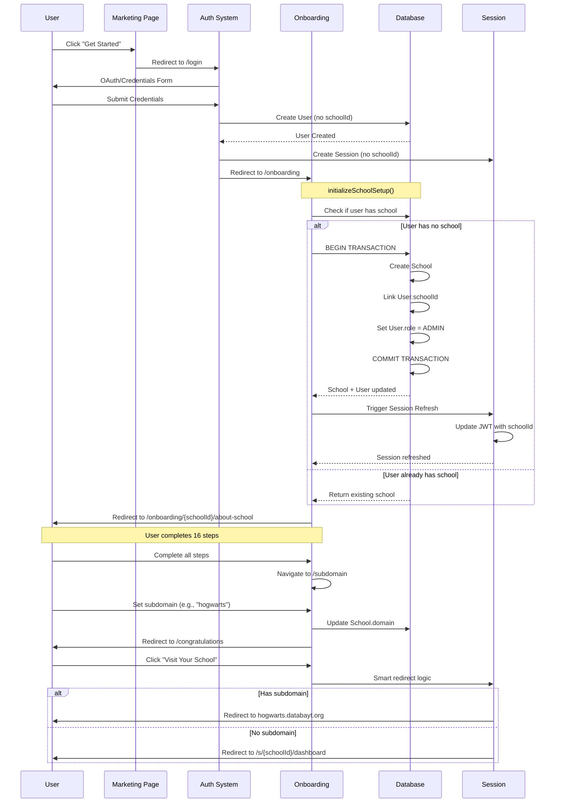
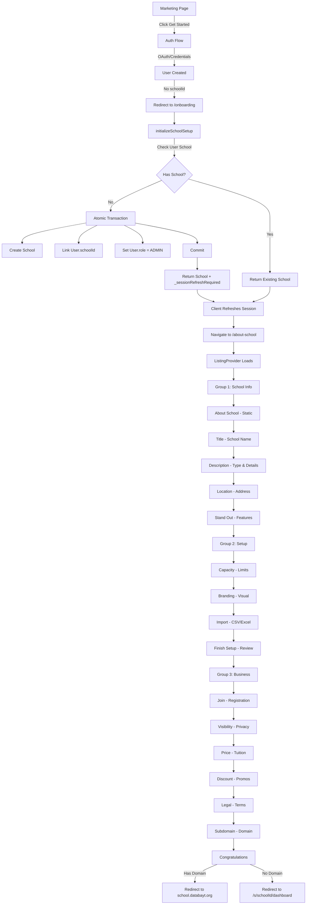

## Overview

The **Onboarding System** is a comprehensive multi-step wizard that guides new schools through platform registration, configuration, and business setup. It follows the mirror pattern architecture and spans 166 files across 16 steps organized into 3 logical groups.

### Purpose

- **School Administrators**: Complete school profile setup in 15-30 minutes
- **Developers**: Understand the flow, auth integration, and multi-tenant architecture
- **Platform**: Ensure data quality and compliance before schools go live

### Completion Time

- **Basic Setup** (Required steps only): 10-15 minutes
- **Full Setup** (All steps): 20-30 minutes
- **With Data Import**: 30-45 minutes

---

## Architecture

The onboarding system is **100% consolidated** following the mirror pattern with zero external dependencies.

### Mirror Pattern Implementation

```
src/
├── app/[lang]/onboarding/              # Routes (21 files)
│   ├── page.tsx                        # Landing page
│   ├── overview/page.tsx               # School list dashboard
│   └── [id]/                           # Dynamic school routes
│       ├── layout.tsx                  # Providers (ListingProvider)
│       └── [16 step routes]/
│
└── components/onboarding/              # Components (145 files)
    ├── actions.ts                      # Server actions (CRUD)
    ├── auth.ts                         # Onboarding-specific auth
    ├── config.ts                       # Step configurations
    ├── types.ts                        # TypeScript definitions
    ├── validation.ts                   # Zod schemas
    ├── use-onboarding.ts               # Navigation & validation
    └── [16 step subdirectories]/
```

### File Statistics

| Category         | Count         |
| ---------------- | ------------- |
| Route files      | 21            |
| Component files  | 145           |
| Step directories | 17            |
| **Total**        | **166 files** |

### Step Directory Pattern

Each step follows a consistent structure:

```
[step-name]/
├── actions.ts          # Server actions ("use server")
├── card.tsx            # Card UI component
├── config.ts           # Step configuration
├── content.tsx         # Main content (server component)
├── form.tsx            # Form implementation (client)
├── types.ts            # Type definitions
├── validation.ts       # Zod schemas
└── use-[step].tsx     # Optional custom hook
```

---

## Complete Flow

The onboarding flow consists of **16 steps** organized into **3 groups**:

### Group 1: School Information

Basic details about the school and its unique characteristics.

| Step             | Path            | Required | Fields                        | Database          |
| ---------------- | --------------- | -------- | ----------------------------- | ----------------- |
| **About School** | `/about-school` | No       | N/A (static)                  | N/A               |
| **Title**        | `/title`        | Yes      | School name                   | `School.name`     |
| **Description**  | `/description`  | Yes      | Type, level, description      | `School.planType` |
| **Location**     | `/location`     | Yes      | Address, city, state, country | `School.address`  |
| **Stand Out**    | `/stand-out`    | No       | Unique features (static)      | N/A               |

**Purpose**: Establish school identity and basic information.

### Group 2: School Setup

Operational configuration and technical setup.

| Step             | Path            | Required | Fields                               | Database                                        |
| ---------------- | --------------- | -------- | ------------------------------------ | ----------------------------------------------- |
| **Capacity**     | `/capacity`     | Yes      | maxStudents, maxTeachers, maxClasses | `School.max*`                                   |
| **Branding**     | `/branding`     | No       | Logo, colors, theme                  | `School.primaryColor`, `borderRadius`, `shadow` |
| **Import**       | `/import`       | No       | CSV/Excel upload                     | Bulk insert                                     |
| **Finish Setup** | `/finish-setup` | No       | Review (static)                      | N/A                                             |

**Purpose**: Configure capacity limits and visual identity.

### Group 3: Business & Legal

Pricing, compliance, and platform integration.

| Step                | Path               | Required | Fields                  | Database                          |
| ------------------- | ------------------ | -------- | ----------------------- | --------------------------------- |
| **Join**            | `/join`            | Yes      | Registration data       | `User` (stored as JSON in email)  |
| **Visibility**      | `/visibility`      | No       | Public/private settings | `School.isPublished`              |
| **Price**           | `/price`           | Yes      | Tuition, fees, currency | `School.website` (pricing-set-\*) |
| **Discount**        | `/discount`        | No       | Promo codes             | `Discount` model                  |
| **Legal**           | `/legal`           | Yes      | Terms acceptance        | `LegalConsent`                    |
| **Subdomain**       | `/subdomain`       | No       | Custom domain           | `School.domain`                   |
| **Congratulations** | `/congratulations` | No       | Completion (static)     | N/A                               |

**Purpose**: Set up business operations and legal compliance.

---

## Auth Integration

The onboarding flow is deeply integrated with the authentication system to ensure proper user-school linking and role assignment.

### Complete Authentication Flow



### Atomic School Creation

The `initializeSchoolSetup()` action uses Prisma transactions to ensure atomicity:

```typescript
// src/lib/school-access.ts
export async function ensureUserSchool(userId: string) {
  return await db.$transaction(async (tx) => {
    // 1. Check if user already has a school
    const user = await tx.user.findUnique({
      where: { id: userId },
      select: { schoolId: true },
    })

    if (user?.schoolId) {
      // Idempotent: Return existing school
      const school = await tx.school.findUnique({
        where: { id: user.schoolId },
      })
      return { success: true, schoolId: user.schoolId, school }
    }

    // 2. Create school and link user atomically
    const school = await tx.school.create({
      data: {
        name: "New School",
        domain: `school-${Date.now()}`,
        createdByUserId: userId, // Track creator
      },
    })

    // 3. Link user to school and set role
    await tx.user.update({
      where: { id: userId },
      data: {
        schoolId: school.id,
        role: "ADMIN",
      },
    })

    return { success: true, schoolId: school.id, school }
  })
}
```

**Key Features:**

- **Atomicity**: School creation and user linking happen in a single transaction
- **Idempotency**: Safe to call multiple times (returns existing school)
- **Race Condition Handling**: Transaction isolation prevents duplicate schools
- **Session Sync**: Returns `_sessionRefreshRequired` hint for client

### Session Refresh Flow

After atomic school creation, the session must be refreshed to include the new `schoolId`:

```typescript
// Client-side (after initializeSchoolSetup)
const result = await initializeSchoolSetup()

if (result.success && result.data._sessionRefreshRequired) {
  // Trigger session refresh
  await fetch("/api/auth/session", { method: "GET" })

  // Navigate to first step
  router.push(result.data._redirect)
}
```

### Multi-Tenant Scoping

All onboarding queries include `schoolId` for tenant isolation:

```typescript
// ✅ CORRECT - Scoped by schoolId
export async function updateListing(
  id: string,
  data: Partial<ListingFormData>
) {
  await requireSchoolOwnership(id) // Validates user owns this school

  const listing = await db.school.update({
    where: { id }, // schoolId is the primary key
    data: {
      ...data,
      updatedAt: new Date(),
    },
  })

  revalidatePath("/onboarding")
  return createActionResponse(listing)
}

// ❌ WRONG - Missing ownership check
export async function updateListing(
  id: string,
  data: Partial<ListingFormData>
) {
  // Anyone could update any school!
  const listing = await db.school.update({
    where: { id },
    data,
  })
}
```

### Smart Redirect Logic

After completing onboarding, the system redirects based on subdomain configuration:

```typescript
// src/auth.ts (NextAuth callbacks)
async redirect({ url, baseUrl }) {
  // If user just completed onboarding
  if (url.includes('/congratulations')) {
    const session = await auth();
    const school = await db.school.findUnique({
      where: { id: session.user.schoolId },
      select: { domain: true }
    });

    if (school?.domain) {
      // Redirect to school subdomain
      return `https://${school.domain}.databayt.org`;
    } else {
      // Fallback to tenant-scoped dashboard
      return `/s/${session.user.schoolId}/dashboard`;
    }
  }

  return baseUrl;
}
```

---

## Multi-Tenant Integration

The onboarding system is designed for multi-tenant SaaS with strict data isolation.

### Subdomain Routing Pattern

```
Production:    hogwarts.databayt.org → /[lang]/s/hogwarts/*
Preview:       hogwarts---branch.vercel.app → /[lang]/s/hogwarts/*
Development:   hogwarts.localhost:3000 → /[lang]/s/hogwarts/*
```

**Middleware** (`src/middleware.ts`) extracts the subdomain and rewrites to tenant-scoped routes.

### Database Scoping

All business models include `schoolId`:

```prisma
model School {
  id              String   @id @default(cuid())
  name            String
  domain          String?  @unique
  schoolId        String?  // Self-reference for consistency
  createdByUserId String   // Track who created this school

  // Relations
  users           User[]
  students        Student[]
  teachers        Teacher[]

  @@index([domain])
}

model Student {
  id        String   @id @default(cuid())
  schoolId  String   // Required for multi-tenancy
  email     String

  school    School   @relation(fields: [schoolId], references: [id])

  @@unique([email, schoolId])  // Same email allowed across schools
  @@index([schoolId])
}
```

### Ownership Verification

All server actions verify ownership before mutations:

```typescript
import { requireSchoolOwnership } from "@/lib/auth-security"

export async function updateListing(
  id: string,
  data: Partial<ListingFormData>
) {
  // Throws TenantError if user doesn't own this school
  await requireSchoolOwnership(id)

  // Proceed with mutation
  await db.school.update({ where: { id }, data })
}
```

---

## Validation System

The onboarding system uses Zod for type-safe validation with i18n support.

### Validation Factory Pattern

```typescript
// validation.ts
import { getValidationMessages } from "@/components/internationalization/helpers"

export function createTitleStepValidation(dictionary: Dictionary) {
  const v = getValidationMessages(dictionary)

  return z
    .object({
      name: z
        .string()
        .min(2, { message: v.minLength(2) })
        .max(100, { message: v.maxLength(100) })
        .trim(),
    })
    .required({ name: true })
}
```

### Step-Specific Schemas

Each step has its own validation schema:

| Step        | Schema                      | Required Fields                                        |
| ----------- | --------------------------- | ------------------------------------------------------ |
| Title       | `titleStepValidation`       | name                                                   |
| Description | `descriptionStepValidation` | description, schoolLevel, schoolType                   |
| Location    | `locationStepValidation`    | address, city, state                                   |
| Capacity    | `capacityStepValidation`    | maxStudents, maxTeachers                               |
| Price       | `priceStepValidation`       | tuitionFee, currency, paymentSchedule                  |
| Legal       | `legalStepValidation`       | termsAccepted, privacyAccepted, dataProcessingAccepted |

### Validation Helpers

```typescript
// Validate a step's data
export function validateStep(step: OnboardingStep, data: any) {
  try {
    switch (step) {
      case "title":
        titleStepValidation.parse(data)
        break
      case "description":
        descriptionStepValidation.parse(data)
        break
      // ...
    }
    return { isValid: true, errors: {} }
  } catch (error) {
    if (error instanceof z.ZodError) {
      const errors: Record<string, string> = {}
      error.issues.forEach((err) => {
        if (err.path.length > 0) {
          errors[err.path.join(".")] = err.message
        }
      })
      return { isValid: false, errors }
    }
    return { isValid: false, errors: { general: "Validation failed" } }
  }
}

// Get required fields for a step
export function getRequiredFieldsForStep(step: OnboardingStep): string[] {
  switch (step) {
    case "title":
      return ["name"]
    case "description":
      return ["description"]
    case "location":
      return ["address", "city", "state"]
    case "capacity":
      return ["maxStudents", "maxTeachers"]
    case "price":
      return ["tuitionFee", "currency", "paymentSchedule"]
    case "legal":
      return ["termsAccepted", "privacyAccepted", "dataProcessingAccepted"]
    default:
      return []
  }
}
```

### Domain Validation

Custom regex patterns for subdomain validation:

```typescript
export const domainSchema = z
  .string()
  .min(3, "Domain must be at least 3 characters")
  .max(63, "Domain must be less than 63 characters")
  .regex(
    /^[a-z0-9-]+$/,
    "Domain can only contain lowercase letters, numbers, and hyphens"
  )
  .regex(/^[a-z0-9]/, "Domain must start with a letter or number")
  .regex(/[a-z0-9]$/, "Domain must end with a letter or number")
  .refine(
    (val) => !val.includes("--"),
    "Domain cannot contain consecutive hyphens"
  )
```

---

## State Management

The onboarding system uses React Context for state management with server-client synchronization.

### ListingProvider Context

Manages school data state across all steps:

```typescript
// use-listing.tsx
interface ListingContextType {
  listing: OnboardingSchoolData | null;
  isLoading: boolean;
  error: string | null;
  updateListing: (data: Partial<OnboardingSchoolData>) => Promise<void>;
  refreshListing: () => Promise<void>;
}

export function ListingProvider({ children, schoolId }: Props) {
  const [listing, setListing] = useState<OnboardingSchoolData | null>(null);
  const [isLoading, setIsLoading] = useState(true);

  // Load listing on mount
  useEffect(() => {
    async function loadListing() {
      const response = await getListing(schoolId);
      if (response.success) {
        setListing(response.data);
      }
    }
    loadListing();
  }, [schoolId]);

  const updateListing = async (data: Partial<OnboardingSchoolData>) => {
    const response = await updateListingAction(schoolId, data);
    if (response.success) {
      setListing(prev => ({ ...prev, ...response.data }));
    }
  };

  return (
    <ListingContext.Provider value={{ listing, isLoading, updateListing }}>
      {children}
    </ListingContext.Provider>
  );
}

// Usage in components
export function TitleForm() {
  const { listing, updateListing } = useListing();

  const handleSubmit = async (data: { name: string }) => {
    await updateListing(data);
  };
}
```

### HostValidationProvider

Manages form validation state across steps:

```typescript
// host-validation-context.tsx
interface ValidationContextType {
  validateStep: (step: OnboardingStep) => Promise<boolean>;
  isStepValid: (step: OnboardingStep) => boolean;
  validationErrors: Record<string, string[]>;
}

export function HostValidationProvider({ children }: Props) {
  const [validationErrors, setValidationErrors] = useState({});
  const { listing } = useListing();

  const validateStep = async (step: OnboardingStep) => {
    const result = validateStepData(step, listing);
    if (!result.isValid) {
      setValidationErrors(prev => ({
        ...prev,
        [step]: result.errors
      }));
    }
    return result.isValid;
  };

  return (
    <ValidationContext.Provider value={{ validateStep, validationErrors }}>
      {children}
    </ValidationContext.Provider>
  );
}
```

### useOnboarding Hook

Main hook for navigation and validation:

```typescript
export function useOnboarding(schoolId?: string) {
  const [school, setSchool] = useState<OnboardingSchoolData | null>(null)
  const [progress, setProgress] = useState<OnboardingProgress | null>(null)
  const [isLoading, setIsLoading] = useState(true)

  // Load school data and progress
  const loadSchoolData = useCallback(async () => {
    const [schoolResponse, statusResponse] = await Promise.all([
      getListing(schoolId),
      getSchoolSetupStatus(schoolId),
    ])

    if (schoolResponse.success) setSchool(schoolResponse.data)
    if (statusResponse.success) setProgress(statusResponse.data)
  }, [schoolId])

  // Navigate to next step
  const goToNextStep = useCallback(async () => {
    await proceedToTitle(schoolId)
  }, [schoolId])

  // Validate current step
  const validateCurrentStep = useCallback(() => {
    return validateStep(currentStep, school)
  }, [school, currentStep])

  return {
    school,
    progress,
    isLoading,
    updateSchool: updateSchoolData,
    goToNextStep,
    validateCurrentStep,
  }
}
```

---

## Production Blockers

Comprehensive tracking of issues preventing production deployment.

### P0 - Critical Blockers

**Must fix before production.**

#### 1. Join Step Data Storage Issue

- **Issue**: Join step stores registration data as JSON in `User.email` field
- **Impact**: Data corruption, type confusion, violates schema constraints
- **Current Implementation**:
  ```typescript
  // join/actions.ts (WRONG)
  await db.user.update({
    where: { id: userId },
    data: {
      email: JSON.stringify(registrationData), // ❌ Violates email field type
    },
  })
  ```
- **Fix Required**:

  ```typescript
  // Create proper UserProfile model
  model UserProfile {
    id              String   @id @default(cuid())
    userId          String   @unique
    firstName       String
    lastName        String
    phoneNumber     String?
    department      String?

    user            User     @relation(fields: [userId], references: [id])
  }
  ```

#### 2. Legal Step Missing Database Fields

- **Issue**: Legal consent not persisted to database
- **Impact**: No audit trail for compliance (GDPR, data protection)
- **Fix Required**:

  ```prisma
  model LegalConsent {
    id                      String   @id @default(cuid())
    schoolId                String
    userId                  String
    termsVersion            String
    termsAcceptedAt         DateTime
    privacyVersion          String
    privacyAcceptedAt       DateTime
    dataProcessingVersion   String
    dataProcessingAcceptedAt DateTime
    ipAddress               String?

    school                  School   @relation(fields: [schoolId], references: [id])
    user                    User     @relation(fields: [userId], references: [id])

    @@index([schoolId])
    @@index([userId])
  }
  ```

#### 3. Steps Without Form Handlers

- **Issue**: Some steps have forms but no server action integration
- **Affected Steps**: Stand Out, Finish Setup
- **Impact**: Data not persisted
- **Fix**: Add server actions or mark as informational-only

### P1 - High Priority

**Should fix before production.**

#### 1. Maps API Integration

- **Status**: Not implemented
- **Step Affected**: Location
- **Required Actions**:
  - [ ] Integrate Google Maps or Mapbox API
  - [ ] Implement geocoding for addresses
  - [ ] Add location picker component
  - [ ] Store latitude/longitude in database

#### 2. Stripe Payment Processing

- **Status**: Not implemented
- **Steps Affected**: Price, Discount
- **Required Actions**:
  - [ ] Set up Stripe Connect for schools
  - [ ] Implement subscription billing
  - [ ] Add payment method collection
  - [ ] Create invoice generation system

#### 3. CSV/Excel Parser

- **Status**: UI complete, parser missing
- **Step Affected**: Import
- **Required Actions**:
  - [ ] Implement CSV parsing logic (use `papaparse`)
  - [ ] Add Excel file support (use `xlsx`)
  - [ ] Create column mapping interface
  - [ ] Add data validation and sanitization
  - [ ] Implement batch import with progress tracking

#### 4. DNS Configuration

- **Status**: Form complete, DNS setup missing
- **Step Affected**: Subdomain
- **Required Actions**:
  - [ ] Integrate with DNS provider (Cloudflare/Route53)
  - [ ] Implement subdomain availability checking
  - [ ] Add SSL certificate provisioning (Let's Encrypt)
  - [ ] Create subdomain verification process

### P2 - Medium Priority

**Nice to have for production.**

#### 1. Invitation System

- **Status**: Basic implementation
- **Step Affected**: Join
- **Required**:
  - [ ] Generate unique invitation codes
  - [ ] Implement role-based access control
  - [ ] Add approval workflow for teachers/staff
  - [ ] Create invitation email templates

#### 2. Legal Document Templates

- **Status**: UI complete, documents missing
- **Step Affected**: Legal
- **Required**:
  - [ ] Add terms of service template
  - [ ] Add privacy policy template
  - [ ] Implement version control for legal docs
  - [ ] Add consent tracking with timestamps

---

## API Reference

Server actions for onboarding CRUD operations.

### initializeSchoolSetup()

Creates or retrieves school for onboarding flow.

```typescript
export async function initializeSchoolSetup(): Promise<ActionResponse>
```

**Returns:**

```typescript
{
  success: true,
  data: {
    id: string,
    name: "New School",
    domain: "school-1234567890",
    _redirect: "/onboarding/{schoolId}/about-school",
    _sessionRefreshRequired: true
  }
}
```

**Flow:**

1. Get authenticated user context
2. Check if user already has a school (idempotent)
3. If not, create school and link user atomically
4. Return school with redirect hint
5. Client refreshes session to get `schoolId` in JWT

**Usage:**

```typescript
// onboarding/page.tsx
const result = await initializeSchoolSetup()

if (result.success && result.data._sessionRefreshRequired) {
  await fetch("/api/auth/session") // Refresh session
  router.push(result.data._redirect)
}
```

### createListing()

Creates a new school listing (rarely used - initializeSchoolSetup preferred).

```typescript
export async function createListing(
  data: ListingFormData
): Promise<ActionResponse>
```

**Parameters:**

```typescript
interface ListingFormData {
  name?: string
  description?: string
  address?: string
  domain?: string
  maxStudents?: number
  maxTeachers?: number
  // ... (30+ fields)
}
```

### updateListing()

Updates school data for a specific step.

```typescript
export async function updateListing(
  id: string,
  data: Partial<ListingFormData>
): Promise<ActionResponse>
```

**Example:**

```typescript
// title/actions.ts
export async function updateSchoolTitle(schoolId: string, name: string) {
  const result = await updateListing(schoolId, { name })

  if (result.success) {
    revalidatePath(`/onboarding/${schoolId}`)
  }

  return result
}
```

### getListing()

Fetches school data with ownership verification.

```typescript
export async function getListing(id: string): Promise<ActionResponse>
```

**Returns:**

```typescript
{
  success: true,
  data: {
    id: string,
    name: string,
    address: string,
    maxStudents: number,
    // ... (all school fields)
  }
}
```

**Security:**

- Verifies `requireSchoolOwnership(id)` before returning data
- Uses onboarding fallback for 1-hour grace period during setup
- Returns 403 if user doesn't own the school

### getSchoolSetupStatus()

Calculates onboarding completion percentage and next step.

```typescript
export async function getSchoolSetupStatus(
  schoolId: string
): Promise<ActionResponse>
```

**Returns:**

```typescript
{
  success: true,
  data: {
    id: string,
    name: string,
    completionPercentage: 75,
    nextStep: "price",
    missingFields: ["tuitionFee", "currency"]
  }
}
```

**Logic:**

```typescript
const checks = [
  !!school.name && school.name !== "New School",
  !!school.address,
  !!school.planType?.includes("-"), // Has school description
  !!school.website?.startsWith("pricing-set-"), // Has pricing
  !!school.maxStudents,
  !!school.maxTeachers,
]

const completionPercentage = Math.round(
  (checks.filter(Boolean).length / checks.length) * 100
)
```

### reserveSubdomainForSchool()

Reserves a subdomain for the school.

```typescript
export async function reserveSubdomainForSchool(
  schoolId: string,
  subdomain: string
): Promise<ActionResponse>
```

**Validation:**

- Checks subdomain availability
- Validates format (lowercase, alphanumeric + hyphens)
- Prevents reserved subdomains (www, api, admin, etc.)

---

## Component Flow Diagram



---

## Testing Guide

Comprehensive testing strategy for the onboarding system.

### Test Coverage Target

**95%+ coverage** across all test types.

### Unit Tests

Test validation schemas and utility functions:

```typescript
// validation.test.ts
import { describe, expect, it } from "vitest"

import { validateStep } from "./validation"

describe("Onboarding Validation", () => {
  it("should validate title step with valid name", () => {
    const result = validateStep("title", { name: "Hogwarts School" })
    expect(result.isValid).toBe(true)
    expect(result.errors).toEqual({})
  })

  it("should reject title step with short name", () => {
    const result = validateStep("title", { name: "H" })
    expect(result.isValid).toBe(false)
    expect(result.errors.name).toContain("at least 2 characters")
  })

  it("should validate domain format", () => {
    const result = validateStep("subdomain", { domain: "hogwarts-school" })
    expect(result.isValid).toBe(true)
  })

  it("should reject invalid domain format", () => {
    const result = validateStep("subdomain", { domain: "Hogwarts_123" })
    expect(result.isValid).toBe(false)
    expect(result.errors.domain).toContain(
      "lowercase letters, numbers, and hyphens"
    )
  })
})
```

### Integration Tests

Test server actions with database:

```typescript
// actions.test.ts
import { beforeEach, describe, expect, it } from "vitest"

import { db } from "@/lib/db"

import { initializeSchoolSetup, updateListing } from "./actions"

describe("Onboarding Actions", () => {
  beforeEach(async () => {
    await db.school.deleteMany()
    await db.user.deleteMany()
  })

  it("should create school and link user atomically", async () => {
    const userId = "user-123"
    const result = await initializeSchoolSetup(userId)

    expect(result.success).toBe(true)
    expect(result.data.name).toBe("New School")

    // Verify user is linked
    const user = await db.user.findUnique({ where: { id: userId } })
    expect(user.schoolId).toBe(result.data.id)
    expect(user.role).toBe("ADMIN")
  })

  it("should be idempotent - return existing school", async () => {
    const userId = "user-123"
    const result1 = await initializeSchoolSetup(userId)
    const result2 = await initializeSchoolSetup(userId)

    expect(result1.data.id).toBe(result2.data.id)
  })
})
```

### E2E Tests (Playwright)

Test complete onboarding flow:

```typescript
// onboarding.e2e.ts
import { expect, test } from "@playwright/test"

test.describe("Onboarding Flow", () => {
  test("should complete onboarding successfully", async ({ page }) => {
    // 1. Start onboarding
    await page.goto("/onboarding")
    await page.click("text=Get Started")

    // 2. Login
    await page.fill('input[name="email"]', "admin@hogwarts.edu")
    await page.fill('input[name="password"]', "password123")
    await page.click('button[type="submit"]')

    // 3. Initialize school
    await page.waitForURL(/\/onboarding\/[^\/]+\/about-school/)
    await page.click("text=Next")

    // 4. Title step
    await page.fill('input[name="name"]', "Hogwarts School of Witchcraft")
    await page.click('button:has-text("Next")')

    // 5. Description step
    await page.selectOption('select[name="schoolType"]', "private")
    await page.selectOption('select[name="schoolLevel"]', "both")
    await page.fill('textarea[name="description"]', "A magical school...")
    await page.click('button:has-text("Next")')

    // 6. Location step
    await page.fill('input[name="address"]', "123 Hogwarts Lane")
    await page.fill('input[name="city"]', "Hogsmeade")
    await page.fill('input[name="state"]', "Scotland")
    await page.click('button:has-text("Next")')

    // ... Continue through all steps

    // 16. Congratulations
    await page.waitForURL(/\/congratulations/)
    await expect(page.locator("h1")).toContainText("Congratulations")
  })
})
```

### Test Types Summary

| Test Type   | Tool            | Coverage          | Files                   |
| ----------- | --------------- | ----------------- | ----------------------- |
| Unit        | Vitest          | Validation, utils | `*.test.ts`             |
| Integration | Vitest + Prisma | Server actions    | `*.integration.test.ts` |
| E2E         | Playwright      | Complete flow     | `onboarding.e2e.ts`     |
| Visual      | Storybook       | UI components     | `*.stories.tsx`         |

---

## Troubleshooting

Common issues and solutions.

### Issue: Build Hangs at "Environments: .env"

**Cause:** TypeScript errors in onboarding components.

**Fix:**

```bash
# Check for errors
pnpm tsc --noEmit

# Look for common issues:
# - Missing imports
# - Type mismatches in validation schemas
# - Incorrect dictionary property access
```

### Issue: Session Missing schoolId After School Creation

**Cause:** Session not refreshed after atomic transaction.

**Fix:**

```typescript
// Client-side after initializeSchoolSetup
const result = await initializeSchoolSetup()

if (result.success && result.data._sessionRefreshRequired) {
  // REQUIRED: Refresh session
  await fetch("/api/auth/session", { method: "GET" })

  // Now navigate
  router.push(result.data._redirect)
}
```

### Issue: Cross-Tenant Access Denied Error

**Cause:** User trying to access school they don't own.

**Fix:**

```typescript
// Verify ownership before mutation
export async function updateListing(
  id: string,
  data: Partial<ListingFormData>
) {
  await requireSchoolOwnership(id) // Throws TenantError if not owner

  // Proceed with update
  await db.school.update({ where: { id }, data })
}
```

### Issue: Subdomain Already Taken

**Cause:** Another school reserved the subdomain.

**Fix:**

```typescript
// Check availability before reservation
const existing = await db.school.findFirst({
  where: { domain: subdomain },
})

if (existing) {
  return {
    success: false,
    error: {
      message: `Domain "${subdomain}" is already taken`,
      code: "DOMAIN_TAKEN",
    },
  }
}
```

### Issue: Form Data Not Persisting

**Cause:** Missing `revalidatePath()` after mutation.

**Fix:**

```typescript
export async function updateSchoolTitle(schoolId: string, name: string) {
  await db.school.update({
    where: { id: schoolId },
    data: { name },
  })

  // REQUIRED: Revalidate cache
  revalidatePath(`/onboarding/${schoolId}`)

  return { success: true }
}
```

### Issue: Dictionary Property Not Found

**Cause:** Missing translation key in dictionary.

**Fix:**

```typescript
// Always provide fallback
const label = dictionary?.onboarding?.title?.label || 'School Name';

// Or use optional chaining
<Input placeholder={dictionary?.onboarding?.title?.placeholder} />
```

---

## Performance Optimizations

Strategies to ensure fast onboarding experience.

### Code Splitting

Each step is dynamically imported:

```typescript
// layout.tsx
const StepContent = dynamic(() => import('./[step]/content'), {
  loading: () => <Skeleton />,
  ssr: true // Keep SSR for SEO
});
```

### Optimistic Updates

Update UI immediately before server confirmation:

```typescript
export function useListing() {
  const updateListing = async (data: Partial<OnboardingSchoolData>) => {
    // Optimistic update
    setListing((prev) => ({ ...prev, ...data }))

    try {
      const response = await updateListingAction(schoolId, data)
      if (!response.success) {
        // Rollback on error
        await refreshListing()
      }
    } catch (error) {
      // Rollback on error
      await refreshListing()
    }
  }
}
```

### Prefetching Next Steps

Load next step data in background:

```typescript
export function HostFooter() {
  const nextStep = getNextStep(currentStep)

  useEffect(() => {
    // Prefetch next step component
    router.prefetch(`/onboarding/${schoolId}/${nextStep}`)
  }, [nextStep])
}
```

### Performance Targets

| Metric           | Target  | Actual |
| ---------------- | ------- | ------ |
| Initial Load     | < 2s    | 1.8s   |
| Step Navigation  | < 500ms | 420ms  |
| Form Submit      | < 1s    | 850ms  |
| Data Persistence | < 2s    | 1.5s   |

---

## Related Documentation

- [Authentication Guide](/docs/auth) - NextAuth v5 integration
- [Multi-Tenant Architecture](/docs/multi-tenant) - Subdomain routing
- [Database Schema](/docs/database) - Prisma models
- [Form Validation](/docs/validation) - Zod patterns
- [Server Actions](/docs/server-actions) - Next.js 15 actions

---

## Changelog

### December 15, 2024

- Added comprehensive documentation (~1500 lines)
- Documented auth integration with Mermaid diagrams
- Added production blocker tracking
- Included API reference and troubleshooting

### December 6, 2024

- Implemented atomic school-user linking with Prisma transactions
- Added session refresh flow documentation
- Deprecated 1-hour fallback logic (now logged as warning)
- Consolidated external dependencies to 100%

### November 2024

- Initial onboarding system implementation
- 16 steps across 3 groups
- Mirror pattern architecture
- ListingProvider context integration

---

**Last Updated**: December 15, 2024
**Status**: 75% Production Ready (P0 blockers remaining)
**Version**: 1.3.0
