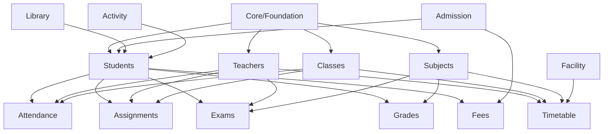

# Hogwarts School Management System - Module Documentation Index

**Complete documentation and implementation tracker for all platform modules**

## 📚 Module Overview

This multi-tenant school management system consists of 15 core modules that work together to provide comprehensive educational institution management. Each module has dedicated README and ISSUE files for documentation and tracking.

---

## Module Implementation Status

| Module | Status | Documentation | Priority | Description |
|--------|--------|---------------|----------|-------------|
| **Core** | ✅ Production | [README](../src/components/platform/README.md) | P0 | Foundation - Students, Teachers, Courses, Departments |
| **Students** | ✅ Production | [README](../src/components/platform/students/README.md) \| [ISSUE](../src/components/platform/students/ISSUE.md) | P0 | Student information management |
| **Teachers** | ✅ Production | [README](../src/components/platform/teachers/README.md) \| [ISSUE](../src/components/platform/teachers/ISSUE.md) | P0 | Faculty management |
| **Classes** | ✅ Production | [README](../src/components/platform/classes/README.md) \| [ISSUE](../src/components/platform/classes/ISSUE.md) | P0 | Class sections and enrollment |
| **Subjects** | ✅ Production | [README](../src/components/platform/subjects/README.md) \| [ISSUE](../src/components/platform/subjects/ISSUE.md) | P0 | Subject catalog and curriculum |
| **Timetable** | ✅ Production | [README](../src/components/platform/timetable/README.md) \| [ISSUE](../src/components/platform/timetable/ISSUE.md) | P0 | Schedule management |
| **Attendance** | ✅ Production | [README](../src/components/platform/attendance/README.md) \| [ISSUE](../src/components/platform/attendance/ISSUE.md) | P0 | Daily attendance tracking |
| **Assignments** | ✅ Production | [README](../src/components/platform/assignments/README.md) \| [ISSUE](../src/components/platform/assignments/ISSUE.md) | P1 | Homework and coursework |
| **Exams** | ✅ Production | [README](../src/components/platform/exams/README.md) \| [ISSUE](../src/components/platform/exams/ISSUE.md) | P1 | Examination management |
| **Grades** | ✅ Production | [README](../src/components/platform/grades/README.md) \| [ISSUE](../src/components/platform/grades/ISSUE.md) | P1 | Results and report cards |
| **Admission** | ✅ Production | [README](../src/components/platform/admission/README.md) \| [ISSUE](../src/components/platform/admission/ISSUE.md) | P1 | Application and enrollment |
| **Fees** | ✅ Production | [README](../src/components/platform/fees/README.md) \| [ISSUE](../src/components/platform/fees/ISSUE.md) | P1 | Financial management |
| **Library** | ✅ Production | [README](../src/components/library/README.md) | P2 | Library management system |
| **Activity** | ✅ Production | [README](../src/components/platform/activity/README.md) | P3 | Co-curricular activities |
| **Facility** | ✅ Production | [README](../src/components/platform/facility/README.md) | P3 | Resource management |

**Status Legend:**
- ✅ **Production** - Fully implemented and tested
- 🚧 **In Progress** - Under active development
- ⏸️ **Planning** - Design phase
- ❌ **Blocked** - Has dependencies or issues

---

## 🏗️ Module Categories

### 1. Foundation Modules (P0 - Critical)
These modules form the core of the system and must be operational for basic functionality.

#### 👥 People Management
- **[Students](../src/components/platform/students/)** - Complete student lifecycle management
- **[Teachers](../src/components/platform/teachers/)** - Faculty profiles and assignments
- **[Parents](../src/components/platform/parents/)** - Guardian accounts and relationships

#### 📚 Academic Structure
- **[Subjects](../src/components/platform/subjects/)** - Curriculum and subject catalog
- **[Classes](../src/components/platform/classes/)** - Grade sections and capacity management
- **[Timetable](../src/components/platform/timetable/)** - Weekly schedule generation

### 2. Academic Operations (P1 - Essential)
Daily academic activities and assessment management.

#### 📝 Assessment & Evaluation
- **[Assignments](../src/components/platform/assignments/)** - Homework distribution and collection
- **[Exams](../src/components/platform/exams/)** - Exam scheduling and marks entry
- **[Grades](../src/components/platform/grades/)** - Result processing and report cards

#### 📅 Daily Management
- **[Attendance](../src/components/platform/attendance/)** - Daily/period attendance tracking
- **[Announcements](../src/components/platform/announcements/)** - School-wide communications
- **[Events](../src/components/platform/events/)** - Calendar and event management

### 3. Administrative Modules (P1 - Business Critical)
Business operations and revenue management.

#### 💰 Financial Management
- **[Admission](../src/components/platform/admission/)** - Application processing and enrollment
- **[Fees](../src/components/platform/fees/)** - Fee collection and financial reporting

### 4. Support Modules (P2 - Enhancement)
Additional features that enhance the platform.

#### 📖 Resource Management
- **[Library](../src/components/library/)** - Book catalog and circulation
- **[Activity](../src/components/platform/activity/)** - Co-curricular activities
- **[Facility](../src/components/platform/facility/)** - Infrastructure and resources

---

## 📋 Implementation Roadmap

### Phase 1: Foundation (Completed ✅)
- [x] Core module structure
- [x] Student management
- [x] Teacher management
- [x] Class organization
- [x] Subject catalog
- [x] Basic timetable

### Phase 2: Academic Operations (Completed ✅)
- [x] Attendance tracking
- [x] Assignment management
- [x] Exam scheduling
- [x] Grade calculation
- [x] Report generation
- [x] Announcements

### Phase 3: Business Operations (Completed ✅)
- [x] Library management
- [x] Admission system
- [x] Fee management
- [x] Payment processing
- [x] Scholarship management
- [x] Refund management

### Phase 4: Enhancement Features (Completed ✅)
- [x] Activity tracking
- [x] Facility management

### Phase 5: Advanced Features (Future 🔮)
- [ ] AI-powered insights
- [ ] Predictive analytics
- [ ] Mobile applications
- [ ] Parent portal app
- [ ] Offline mode
- [ ] Third-party integrations

---

## 🔗 Module Dependencies



---

## 📁 Module File Structure

Each module follows a consistent structure:

```
src/components/platform/[module]/
├── README.md           # Module documentation
├── ISSUE.md           # Production tracker
├── content.tsx        # Main server component
├── table.tsx          # Data table client component
├── columns.tsx        # Table column definitions
├── form.tsx           # Create/edit forms
├── validation.ts      # Zod schemas
├── actions.ts         # Server actions
├── types.ts           # TypeScript types
├── list-params.ts     # URL state management
├── config.ts          # Module configuration
└── utils.ts           # Utility functions
```

---

## 🛠️ Development Guidelines

### For New Modules

1. **Create Module Structure**
   ```bash
   mkdir src/components/platform/[module]
   ```

2. **Use Templates**
   - Copy [README Template](./templates/README-TEMPLATE.md)
   - Copy [ISSUE Template](./templates/ISSUE-TEMPLATE.md)

3. **Follow Patterns**
   - Mirror pattern: Route matches component folder
   - Server actions with "use server"
   - Multi-tenant scoping with schoolId
   - Zod validation (client + server)

4. **Documentation Requirements**
   - Complete README with workflows
   - ISSUE tracker with checklist
   - API documentation
   - User guides

### For Existing Modules

1. **Check Documentation**
   - Ensure README is current
   - Update ISSUE tracker status
   - Document new features

2. **Test Coverage**
   - Unit tests for logic
   - Integration tests for workflows
   - E2E tests for user journeys

3. **Performance**
   - Database indexes
   - Query optimization
   - Caching strategy

---

## 🔍 Quick Links

### Documentation
- [Platform Architecture](../CLAUDE.md)
- [Features Overview](../FEATURES.md)
- [API Documentation](../docs/api/)
- [User Guides](../docs/guides/)

### Development
- [Setup Guide](../README.md#getting-started)
- [Contributing](../CONTRIBUTING.md)
- [Testing Guide](../docs/testing/)
- [Deployment](../docs/deployment/)

### Module-Specific Docs
- [Students Documentation](../src/components/platform/students/README.md)
- [Teachers Documentation](../src/components/platform/teachers/README.md)
- [Attendance Documentation](../src/components/platform/attendance/README.md)
- [Exams Documentation](../src/components/platform/exams/README.md)
- [Fees Documentation](../src/components/platform/fees/README.md)
- [Admission Documentation](../src/components/platform/admission/README.md)

---

## 📊 Module Metrics

### Implementation Progress
- **Completed Modules:** 15/15 (100%)
- **In Progress:** 0/15 (0%)
- **Planned:** 0/15 (0%)

### Documentation Coverage
- **Full Documentation:** 12/15 modules
- **Partial Documentation:** 1/15 modules
- **No Documentation:** 2/15 modules

### Test Coverage
- **Unit Tests:** 8/15 modules
- **Integration Tests:** 6/15 modules
- **E2E Tests:** 5/15 modules

---

## 🤝 Contributing

To contribute to module development:

1. **Pick a Module** - Choose from planning/in-progress modules
2. **Read Templates** - Follow documentation templates
3. **Implement** - Use existing patterns and conventions
4. **Document** - Update README and ISSUE files
5. **Test** - Add comprehensive tests
6. **Submit PR** - Include screenshots and testing evidence

### Priority Order
1. Complete in-progress modules
2. Start high-priority planned modules
3. Enhance existing modules
4. Add nice-to-have features

---

## 📞 Support

- **Documentation Issues:** Create issue with `docs` label
- **Module Bugs:** Use module-specific issue tracker
- **Feature Requests:** Add to module ISSUE.md
- **General Questions:** Platform README

---

**Last Updated:** 2025-10-17
**Maintained By:** Platform Team
**License:** MIT