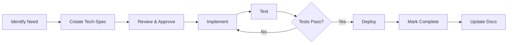

# Technical Specifications (Tech-Specs)

This directory contains **Level 0 technical specifications** for small features, enhancements, and bug fixes in the Hogwarts platform. Tech-specs follow the **BMAD-METHOD** (Battle-tested Multi-Agent Development) workflow adapted for Hogwarts.

---

## What Are Tech-Specs?

Tech-specs are detailed implementation guides for **small, atomic changes** that can be completed in **1-4 hours**. They provide developers (including AI agents) with all the context, code examples, and step-by-step instructions needed to implement a feature successfully.

### When to Use Tech-Specs

**Use tech-specs for:**
- ✅ Small feature additions (1-4 hours of work)
- ✅ Bug fixes requiring architectural context
- ✅ Minor enhancements to existing features
- ✅ Schema changes (adding fields, indexes)
- ✅ UI enhancements (adding buttons, forms)
- ✅ Integration additions (new export formats, etc.)

**Don't use tech-specs for:**
- ❌ Large features (use epics from `/epics.md` instead)
- ❌ Breaking changes requiring multiple PRs
- ❌ Features spanning multiple epics
- ❌ Architectural decisions (use ADRs in `/architecture.md`)

---

## Tech-Spec Index

### Active Specs

| ID | Title | Type | Status | Est. Time | Priority |
|----|-------|------|--------|-----------|----------|
| [TS-001](./001-qr-code-expiration-config.md) | QR Code Expiration Configuration | Enhancement | Draft | 2-3 hrs | Medium |
| [TS-002](./002-export-attendance-excel.md) | Export Attendance to Excel | Enhancement | Draft | 2-3 hrs | High |
| [TS-003](./003-add-student-email-field.md) | Add Student Email Field | Enhancement | Draft | 1-2 hrs | Medium |

### Completed Specs

_No completed specs yet. Specs will be moved here after implementation and deployment._

---

## Tech-Spec Template

All tech-specs follow a standardized template: [`TEMPLATE.md`](./TEMPLATE.md)

The template includes:
1. **Context** - Project stack, existing structure, related docs
2. **The Change** - Problem statement, user story, proposed solution, scope
3. **Implementation Details** - Source tree changes, technical approach, code examples
4. **Development Context** - Dependencies, conventions, test framework
5. **Implementation Guide** - Step-by-step instructions with time estimates
6. **Testing Approach** - Unit tests, E2E tests, manual testing checklist
7. **Deployment Strategy** - Deployment steps, rollback plan, monitoring
8. **Developer Resources** - File paths, key locations, documentation to update

---

## How to Use Tech-Specs

### For Developers

**1. Read the Spec:**
- Understand the problem statement and user story
- Review the proposed solution and scope
- Check dependencies and prerequisites

**2. Implement:**
- Follow the implementation steps in order
- Use the provided code examples as templates
- Run tests after each major step

**3. Test:**
- Run unit tests: `pnpm test <file>`
- Run E2E tests: `pnpm test:e2e <spec>`
- Complete manual testing checklist

**4. Deploy:**
- Push to feature branch
- Create PR with link to tech-spec
- Deploy to production after review

**5. Complete:**
- Mark spec as "Completed" in README
- Update related documentation
- Add CHANGELOG entry

### For AI Agents

**Claude Code agents can:**
- Read tech-specs for full context
- Generate code following exact patterns
- Run tests and verify implementation
- Update documentation automatically

**Example:**
```
Claude, implement TS-002 (Export Attendance to Excel) following the tech-spec exactly.
```

Claude will:
1. Read the full tech-spec
2. Create all required files
3. Follow coding patterns precisely
4. Run tests
5. Report completion status

---

## Creating New Tech-Specs

### Step 1: Copy Template

```bash
cp docs/tech-specs/TEMPLATE.md docs/tech-specs/XXX-feature-name.md
```

### Step 2: Fill in Placeholders

Replace all `{{variable}}` placeholders and `[examples]` with actual values:

- `{{project_name}}` → "Hogwarts"
- `{{date}}` → Current date (YYYY-MM-DD)
- `{{problem_statement}}` → Describe the problem
- `{{solution_overview}}` → High-level solution
- `{{implementation_steps}}` → Step-by-step guide

### Step 3: Adapt Sections

Customize sections based on the feature:
- **Database Changes:** Include Prisma schema and migrations
- **UI Changes:** Include component code and styling
- **API Changes:** Include server actions and validation
- **No Database Changes:** Remove migration sections

### Step 4: Add Code Examples

Include actual code examples (not pseudocode):
- ✅ Use real file paths from the project
- ✅ Follow existing patterns exactly
- ✅ Include full function signatures
- ✅ Show error handling

### Step 5: Add to Index

Update this README's "Active Specs" table with:
- Tech-spec ID (e.g., TS-004)
- Title
- Type (Enhancement, Bug Fix, Refactor)
- Status (Draft, In Progress, Completed)
- Estimated time
- Priority (High, Medium, Low)

---

## Tech-Spec Workflow



**1. Identify Need:**
- Triage issue/request
- Determine if Level 0 (1-4 hours)
- If yes → Create tech-spec

**2. Create Tech-Spec:**
- Copy template
- Fill in all sections
- Add code examples
- Estimate time

**3. Review & Approve:**
- Tech lead reviews spec
- Verify scope is small enough
- Check code examples follow patterns
- Approve or request changes

**4. Implement:**
- Developer (or AI agent) implements
- Follow steps exactly as written
- Use provided code examples

**5. Test:**
- Run unit tests
- Run E2E tests
- Complete manual checklist

**6. Deploy:**
- Push to production
- Monitor for errors

**7. Mark Complete:**
- Move spec to "Completed" section
- Add completion date
- Link to PR/commit

**8. Update Docs:**
- Update related documentation
- Add CHANGELOG entry
- Update PRD/epics if needed

---

## Tech-Spec Best Practices

### Writing Good Tech-Specs

**Do:**
- ✅ Start with a clear user story
- ✅ Provide complete code examples
- ✅ Include step-by-step instructions
- ✅ Specify exact file paths
- ✅ List all acceptance criteria
- ✅ Include testing instructions
- ✅ Estimate time accurately
- ✅ Reference existing patterns
- ✅ Show error handling

**Don't:**
- ❌ Leave placeholders unfilled
- ❌ Use pseudocode (use real code)
- ❌ Skip testing sections
- ❌ Forget multi-tenant safety
- ❌ Ignore accessibility
- ❌ Skip i18n considerations
- ❌ Use vague instructions
- ❌ Omit rollback plans

### Implementation Patterns to Follow

All tech-specs MUST follow these Hogwarts patterns:

**1. Multi-Tenant Safety:**
```typescript
// ✅ CORRECT - Scoped by schoolId
const { schoolId } = await getTenantContext()
const data = await db.model.findMany({
  where: { schoolId }
})

// ❌ WRONG - No tenant scoping
const data = await db.model.findMany()
```

**2. Server Actions:**
```typescript
"use server"

export async function myAction(input: z.infer<typeof schema>) {
  // 1. Authentication
  const session = await auth()
  if (!session) throw new Error("Unauthorized")

  // 2. Authorization (role check)
  if (!["ADMIN"].includes(session.user.role)) {
    throw new Error("Forbidden")
  }

  // 3. Tenant context (CRITICAL)
  const { schoolId } = await getTenantContext()

  // 4. Validation
  const parsed = schema.parse(input)

  // 5. Database operation (with schoolId)
  const result = await db.model.create({
    data: { ...parsed, schoolId }
  })

  // 6. Revalidate
  revalidatePath("/path")

  return { success: true, data: result }
}
```

**3. Validation:**
```typescript
// validation.ts
export const mySchema = z.object({
  field: z.string().min(1, "Required"),
  email: z.string().email().optional()
})

// form.tsx
const form = useForm({
  resolver: zodResolver(mySchema)
})
```

**4. Typography (Semantic HTML):**
```typescript
// ✅ CORRECT - Semantic HTML
<h2>Section Title</h2>
<p className="muted">Description text</p>

// ❌ WRONG - Hardcoded classes
<div className="text-2xl font-bold">Section Title</div>
<div className="text-sm text-muted-foreground">Description</div>
```

---

## Tech-Spec Quality Checklist

Before marking a tech-spec as "Ready for Implementation":

### Completeness
- [ ] All template sections filled in (no placeholders)
- [ ] Code examples use real file paths
- [ ] User story clearly defined
- [ ] Acceptance criteria listed
- [ ] Time estimate provided

### Technical Accuracy
- [ ] Multi-tenant safety addressed (schoolId scoping)
- [ ] Authentication and authorization considered
- [ ] Error handling included
- [ ] Validation (client + server) specified
- [ ] Database migrations documented (if needed)

### Implementation Clarity
- [ ] Step-by-step instructions provided
- [ ] Code examples follow Hogwarts patterns
- [ ] Testing strategy defined
- [ ] Rollback plan documented
- [ ] File paths are accurate

### Testing
- [ ] Unit test examples provided
- [ ] E2E test examples provided
- [ ] Manual testing checklist included
- [ ] Edge cases considered

### Documentation
- [ ] Related docs listed (PRD, epics, architecture)
- [ ] Dictionary keys specified (i18n)
- [ ] Accessibility considerations noted
- [ ] Deployment strategy documented

---

## FAQs

### Q: When should I create a tech-spec vs. start coding?

**A:** Create a tech-spec if:
- Feature touches multiple files (3+)
- Requires database migration
- Involves complex validation
- Needs architectural context
- Will be implemented by AI agents
- Other developers need to understand the change

Skip tech-spec for trivial changes:
- Typo fixes
- Simple CSS tweaks
- Documentation updates

### Q: How detailed should code examples be?

**A:** Code examples should be **copy-pasteable** with minimal modifications. Include:
- Full function signatures
- Imports
- Error handling
- Comments for clarity
- Exact variable names from the project

Avoid pseudocode or placeholders.

### Q: Can I deviate from a tech-spec during implementation?

**A:** Yes, but document the deviation:
1. If minor: Add comment in PR explaining why
2. If major: Update the tech-spec first, then implement
3. Always update tech-spec after implementation to reflect actual code

### Q: How do I handle database migrations in tech-specs?

**A:** Include:
1. Exact Prisma schema changes
2. Migration command: `pnpm prisma migrate dev --name <name>`
3. Expected SQL output (generated by Prisma)
4. Rollback plan (if migration fails)
5. Note if migration is backward compatible

### Q: What if a tech-spec takes longer than estimated?

**A:** Common for initial specs. Update the estimate in the spec for future reference. If >4 hours, consider if it should be an epic instead.

---

## Related Documentation

- **PRD:** `/PRD.md` - Product Requirements Document with 200+ functional requirements
- **Epics:** `/epics.md` - 12 epics with 190+ stories for large features
- **Architecture:** `/architecture.md` - System architecture with ADRs and patterns
- **BMAD-METHOD:** BMAD workflow templates in `/BMAD-METHOD-main/`

---

## Contributing

To contribute a new tech-spec:

1. **Fork** the repository
2. **Create** a new tech-spec using the template
3. **Implement** the feature following the spec
4. **Test** thoroughly (unit + E2E + manual)
5. **Submit PR** with link to tech-spec
6. **Update** this README's index

---

## Tech-Spec Lifecycle

```
Draft → In Review → Approved → In Progress → Testing → Deployed → Completed
```

- **Draft**: Spec being written, not ready for implementation
- **In Review**: Awaiting technical review and approval
- **Approved**: Ready for implementation
- **In Progress**: Currently being implemented
- **Testing**: Implementation complete, undergoing testing
- **Deployed**: Deployed to production, monitoring
- **Completed**: Verified working in production, archived

---

## Questions?

For questions about tech-specs:
- **GitHub Issues**: [Open an issue](https://github.com/hogwarts/app/issues)
- **Email**: dev@hogwarts.app
- **Discord**: [Join #dev-specs channel](https://discord.gg/hogwarts)

---

**Last Updated:** 2025-01-03
**Version:** 1.0
**Maintained By:** Hogwarts Product & Engineering Team
