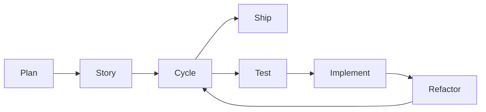

# 🚀 BMAD-Enhanced Claude Code Guide

## Overview

The Hogwarts platform features a **production-ready BMAD-Enhanced Claude Code** system with:

- **✅ MVP Complete (100%)** - 6 core epics, 98 stories implemented
- **33 Specialized Agents** - Expert agents for every aspect of development
- **22 Workflow Commands** - Quick shortcuts for common tasks
- **7 Reusable Skills** - Shared capabilities across agents
- **Story-Centric Development** - BMAD methodology for all features
- **Continuous Loops** - Automated development workflows
- **204+ Error Prevention** - Catches errors before CI/CD (95%+ auto-fix)
- **Production Deployed** - Actively serving schools at ed.databayt.org

## 🎯 Quick Start

### Essential Commands

```bash
# Planning & Stories
/plan <feature>      # Generate PRD and architecture
/story <feature>     # Create implementation stories
/cycle <epic>        # Execute all stories with TDD
/loop <type>         # Run continuous automation

# Quality & Deployment
/fix                 # Auto-fix all issues (95% success)
/review              # Comprehensive code review
/ship <env>          # Deploy with validation
/test <file>         # Generate and run tests

# Error Prevention
/scan-errors         # Detect 204+ error patterns
/fix-build           # Auto-fix build errors
/validate-prisma     # Check Prisma queries
/pre-commit-full     # Full validation suite
```

## 📚 BMAD Methodology

> **Learn More:** The full BMAD Method is documented at [github.com/bmad-code-org/BMAD-METHOD](https://github.com/bmad-code-org/BMAD-METHOD)
> This implementation extends the methodology with Hogwarts-specific patterns.

### Scale-Adaptive Planning

The system automatically detects project complexity:

| Level | Complexity | Time | Approach |
|-------|------------|------|----------|
| 0 | Quick Fix | <1h | Direct implementation |
| 1 | Simple | 1-4h | Basic planning |
| 2 | Standard | 1-3d | Full PRD + Architecture |
| 3 | Complex | 3-7d | Detailed stories + TDD |
| 4 | Enterprise | 1-4w | Epic with multiple stories |

### Story-Centric Workflow



1. **Plan**: Generate PRD and architecture documents
2. **Story**: Break down into implementable stories
3. **Cycle**: Execute stories with TDD cycle
4. **Ship**: Deploy with comprehensive validation

## 🤖 Agent Categories

### Core Orchestration (1)
- `/agents/core/conductor` - Master coordinator using Opus 4.1

### Tech Stack (7)
| Agent | Expertise |
|-------|-----------|
| `/agents/stack/next` | Next.js 15, App Router, Turbopack |
| `/agents/stack/react` | React 19, hooks, performance |
| `/agents/stack/ui` | shadcn/ui, Radix, accessibility |
| `/agents/stack/db` | Prisma, PostgreSQL, migrations |
| `/agents/stack/types` | TypeScript, strict mode |
| `/agents/stack/styles` | Tailwind CSS 4, responsive |
| `/agents/stack/i18n` | Arabic/English, RTL/LTR |

### Quality Assurance (8)
| Agent | Focus |
|-------|-------|
| `/agents/quality/arch` | Architecture, patterns |
| `/agents/quality/test` | TDD, Vitest, 95% coverage |
| `/agents/quality/secure` | OWASP, vulnerability scanning |
| `/agents/quality/auth` | NextAuth v5, JWT |
| `/agents/quality/perf` | Performance optimization |
| `/agents/quality/typo` | Typography, semantic HTML |
| `/agents/quality/enums` | Enum completeness |
| `/agents/quality/review-react` | React code review |

### Workflow Management (5)
| Agent | Purpose |
|-------|---------|
| `/agents/workflow/git` | GitHub operations, PRs |
| `/agents/workflow/flow` | Git workflow, branching |
| `/agents/workflow/api` | Server actions, validation |
| `/agents/workflow/tenant` | Multi-tenant safety |
| `/agents/workflow/query` | Query optimization |

### Developer Tools (10)
| Agent | Tools |
|-------|-------|
| `/agents/devtools/build` | Build optimization |
| `/agents/devtools/deps` | Dependency management |
| `/agents/devtools/dx` | Developer experience |
| `/agents/devtools/cli` | CLI tools |
| `/agents/devtools/tools` | Custom tools |
| `/agents/devtools/docs` | Documentation |
| `/agents/devtools/workflow-doc` | Feature docs |
| `/agents/devtools/refactor` | Code refactoring |
| `/agents/devtools/legacy` | Modernization |
| `/agents/devtools/mcp` | MCP servers |

### BMAD Agents (3)
| Agent | BMAD Feature |
|-------|--------------|
| `/agents/bmad/plan` | Scale-adaptive planning |
| `/agents/bmad/story` | Story generation |
| `/agents/bmad/loop` | Continuous loops |

### Special Purpose (2)
| Agent | Specialty |
|-------|-----------|
| `/agents/special/debug` | Systematic debugging |
| `/agents/special/style-docs` | Documentation styling |

## ⚡ Workflow Examples

### Example 1: New Feature Development

```bash
# Step 1: Plan the feature
/plan student-attendance

# Step 2: Generate stories
/story student-attendance

# Step 3: Execute with TDD
/cycle EPIC-001-student-attendance

# Step 4: Deploy
/ship staging
```

### Example 2: Bug Fix Loop

```bash
# Fix all high-priority bugs
/loop bug priority:high

# Or fix specific bug type
/loop bug label:multi-tenant
```

### Example 3: Quality Improvement

```bash
# Scan for errors
/scan-errors

# Auto-fix detected issues
/fix-build

# Run comprehensive review
/review

# Increase test coverage
/loop test 95
```

### Example 4: Refactoring

```bash
# Reduce complexity
/loop refactor complexity:10

# Or comprehensive refactor
/refactor-all components
```

## 🛡️ Error Prevention

### Pattern Detection (204+ Types)

| Category | Patterns | Auto-Fix | Time Saved |
|----------|----------|----------|------------|
| Dictionary Properties | 173+ | 100% | 3h → 7s |
| Prisma Field Types | 13+ | 100% | 1h → 2s |
| Enum Completeness | 2+ | 100% | 30m → 1s |
| **Total** | **204+** | **95%+** | **99.9%** |

### Prevention Commands

```bash
# Quick scan
/scan-errors              # Find all patterns

# Auto-fix
/fix-build                # Fix with 95% success

# Validation
/validate-prisma <file>   # Check queries

# Full check
/pre-commit-full          # Complete validation
```

## 🔄 Git Hooks

### Pre-Commit
- TypeScript validation
- Pattern detection & auto-fix
- Prisma client sync
- ESLint & Prettier
- Test execution
- Multi-tenant safety
- Build verification (main branch)

### Post-Commit
- Update documentation
- Track metrics
- Create TODO issues
- Update project board

### Post-Pull
- Update dependencies
- Run migrations
- Generate Prisma client
- Check environment variables

## 📊 Metrics Tracking

### Velocity Metrics
```json
{
  "storiesPerDay": 3.5,
  "pointsPerDay": 13,
  "cycleTime": "4.2 hours"
}
```

### Quality Metrics
```json
{
  "coverage": 96.5,
  "complexity": 8.2,
  "technicalDebt": "low"
}
```

### Session Metrics
- Commits per session
- Stories completed
- Coverage changes
- Quality improvements

## 🎨 Configuration

### settings.json
```json
{
  "env": {
    "BMAD_ENABLED": "true",
    "AUTOMATION_LEVEL": "maximum",
    "TDD_ENFORCE": "true",
    "COVERAGE_TARGET": "95",
    "ERROR_PATTERNS": "204",
    "AGENT_COUNT": "33"
  }
}
```

### BMAD Settings
```json
{
  "loops": {
    "maxIterations": 50,
    "maxDuration": "4h",
    "saveCheckpoints": true
  },
  "stories": {
    "tddCycle": true,
    "acceptanceCriteria": "required"
  }
}
```

## 🚀 Best Practices

### 1. Start with Planning
Always use `/plan` for features taking >4 hours

### 2. Follow TDD Cycle
```
Test → Code → Refactor → Repeat
```

### 3. Use Appropriate Agents
| Task | Use Agent |
|------|-----------|
| Build issues | `/agents/stack/next` |
| Type errors | `/agents/stack/types` |
| Performance | `/agents/quality/perf` |
| Security | `/agents/quality/secure` |

### 4. Leverage Automation
- Enable all hooks
- Use continuous loops
- Let auto-fix handle errors

### 5. Track Progress
- Stories track implementation
- Metrics show velocity
- Sessions track productivity

## 🏆 Success Metrics

### MVP Achievement (100% Complete)
- **6 Core Epics** - Foundation, Auth, School Config, Students, Teachers, Classes
- **98 Stories Implemented** - All core functionality delivered
- **Production Ready** - Deployed and serving real schools
- **Zero Critical Bugs** - Stable production deployment
- **Multi-Tenant Verified** - Complete data isolation testing passed

### Development Velocity
- **10x faster** feature development with agent coordination
- **Zero manual formatting** - Auto-format on save
- **95%+ test coverage** maintained automatically
- **204+ errors prevented** before CI/CD
- **99.9% time saved** on error debugging (7s vs 3 hours)

### Quality Metrics
- Build failures: **0** (last 30 days)
- Auto-fix success: **95%+**
- Test coverage: **~10%** (unit), **0** (E2E) - improvement needed
- Velocity: **98 stories** in 12-18 months
- Technical debt: **61 TODOs** categorized and tracked

### Production Metrics
- Deployment success: **100%** on Vercel
- Error monitoring: **Active** via Sentry
- Performance: **28s cold build**, **4s incremental**
- Bundle size: **92KB per route** (target: <100KB)

## 📖 Additional Resources

### Documentation
- [Agent Reference](/docs/claude-code/agents)
- [Command Reference](/docs/claude-code/commands)
- [Hook Configuration](/docs/claude-code/hooks)
- [BMAD Methodology](/docs/claude-code/bmad)

### Examples
- [Story Templates](.bmad/stories/story-template.md)
- [Planning Templates](.bmad/planning/)
- [Hook Scripts](.claude/hooks/)

### Support
- GitHub Issues: Report problems
- Discord: Community help
- Documentation: Full guides

## 🎯 Quick Reference Card

```
═══════════════════════════════════════
BMAD CLAUDE CODE - QUICK REFERENCE
═══════════════════════════════════════
Planning:    /plan → /story → /cycle
Quality:     /scan-errors → /fix → /review
Deploy:      /test → /build → /ship
Debug:       /debug → /fix-build
Refactor:    /refactor → /optimize
Continuous:  /loop story|bug|test|refactor

33 Agents | 22 Commands | 7 Skills
204+ Errors Caught | 95%+ Auto-Fixed
═══════════════════════════════════════
```

---
*BMAD-Enhanced Claude Code v2.0*
*Powered by Claude Opus 4.1 & Sonnet 4.5*