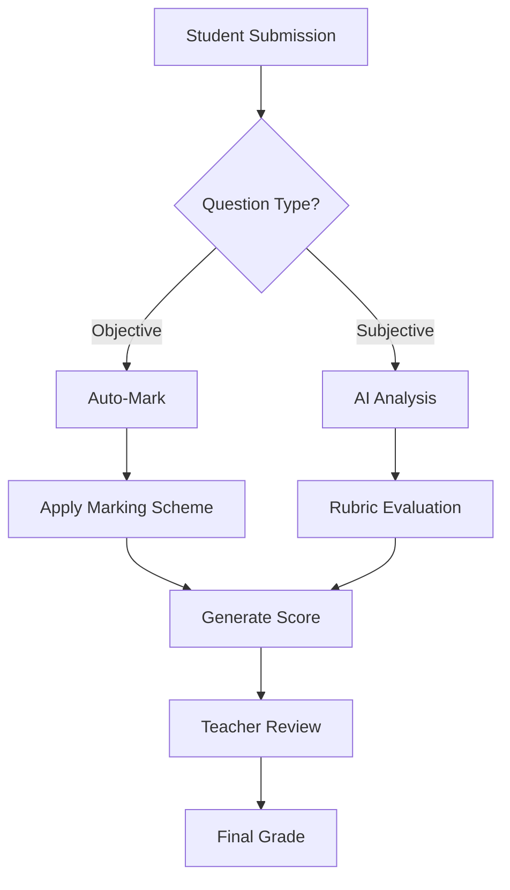

# Auto-Marking System

Comprehensive guide to automated grading with AI assistance, rubric-based evaluation, and manual override capabilities.

---

## Overview

The Auto-Marking System provides intelligent grading capabilities:
- **Automatic grading** for objective questions (MCQ, True/False)
- **AI-assisted evaluation** for essays and subjective answers
- **Rubric-based scoring** with customizable criteria
- **Partial marking** for multi-part questions
- **Manual override** and adjustment options
- **Bulk marking** for efficient processing

---

## Marking Workflow

### Automatic Processing Pipeline



### Marking Stages

| Stage | Description | Time |
|-------|-------------|------|
| **Collection** | Gather all submissions | Instant |
| **Auto-Processing** | Mark objective questions | 1-2 sec/submission |
| **AI Evaluation** | Grade essays | 5-10 sec/essay |
| **Review Queue** | Teacher verification | Manual |
| **Finalization** | Lock grades | Instant |

---

## Question-Type Specific Marking

### 1. Multiple Choice Questions

#### Marking Logic
```typescript
function markMCQ(studentAnswer: string, correctAnswer: string, marks: number) {
  if (studentAnswer === correctAnswer) {
    return marks;
  }
  if (negativeMarking) {
    return -0.25 * marks; // Typical negative marking
  }
  return 0;
}
```

#### Advanced Options
- **Partial credit** for multiple correct answers
- **Negative marking** for wrong answers
- **No penalty** for unanswered questions
- **Weighted options** for different values

### 2. True/False Questions

#### Simple Binary Marking
```typescript
function markTrueFalse(studentAnswer: boolean, correctAnswer: boolean, marks: number) {
  return studentAnswer === correctAnswer ? marks : 0;
}
```

### 3. Short Answer Questions

#### Matching Strategies

| Strategy | Description | Use Case |
|----------|-------------|----------|
| **Exact Match** | Identical text required | Technical terms |
| **Contains Keywords** | Must include specific words | Definitions |
| **Fuzzy Match** | Allow minor variations | Names, spelling |
| **Semantic Match** | AI-based meaning comparison | Concepts |

#### Configuration Example
```json
{
  "matchingStrategy": "FUZZY",
  "caseSensitive": false,
  "acceptableVariations": ["USA", "United States", "America"],
  "partialMarking": {
    "enabled": true,
    "keywords": [
      { "word": "democracy", "marks": 0.5 },
      { "word": "federal", "marks": 0.5 }
    ]
  }
}
```

### 4. Essay Questions

#### AI-Powered Evaluation

**Processing Steps:**
1. **Content Analysis**
   - Topic relevance check
   - Argument structure evaluation
   - Evidence assessment

2. **Quality Metrics**
   - Grammar and spelling
   - Coherence and flow
   - Vocabulary richness

3. **Rubric Application**
   - Map content to criteria
   - Calculate weighted scores
   - Generate feedback

#### Rubric Configuration

```typescript
interface EssayRubric {
  criteria: [
    {
      name: "Understanding",
      description: "Demonstrates clear understanding of topic",
      weight: 30,
      levels: [
        { score: 100, description: "Excellent understanding" },
        { score: 75, description: "Good understanding" },
        { score: 50, description: "Basic understanding" },
        { score: 25, description: "Limited understanding" }
      ]
    },
    {
      name: "Analysis",
      weight: 40,
      // ... similar structure
    },
    {
      name: "Examples",
      weight: 20,
      // ... similar structure
    },
    {
      name: "Conclusion",
      weight: 10,
      // ... similar structure
    }
  ]
}
```

### 5. Fill in the Blank

#### Marking Configuration
```json
{
  "blanks": [
    {
      "position": 1,
      "correctAnswer": "photosynthesis",
      "acceptableVariations": ["photo synthesis", "photosyntheses"],
      "marks": 1,
      "caseSensitive": false
    }
  ],
  "partialCredit": true
}
```

### 6. Matching Questions

#### Scoring Methods
- **All or nothing**: Full marks only if all correct
- **Per pair**: Marks for each correct match
- **Penalty for wrong**: Deduct for incorrect matches

---

## Rubric Management

### Creating Rubrics

#### Step 1: Define Criteria
Identify assessment dimensions:
- Content knowledge
- Critical thinking
- Communication
- Application
- Creativity

#### Step 2: Set Weights
Allocate importance percentages:
```
Understanding: 30%
Analysis: 40%
Examples: 20%
Presentation: 10%
Total: 100%
```

#### Step 3: Create Performance Levels

| Level | Score Range | Description |
|-------|-------------|-------------|
| **Excellent** | 90-100% | Exceeds expectations |
| **Good** | 70-89% | Meets expectations |
| **Satisfactory** | 50-69% | Basic requirements met |
| **Needs Improvement** | <50% | Below expectations |

### Rubric Templates

#### Science Lab Report
```typescript
{
  criteria: [
    { name: "Hypothesis", weight: 20 },
    { name: "Methodology", weight: 25 },
    { name: "Data Analysis", weight: 25 },
    { name: "Conclusion", weight: 20 },
    { name: "Presentation", weight: 10 }
  ]
}
```

#### Literature Essay
```typescript
{
  criteria: [
    { name: "Thesis Statement", weight: 15 },
    { name: "Literary Analysis", weight: 35 },
    { name: "Evidence/Quotes", weight: 25 },
    { name: "Organization", weight: 15 },
    { name: "Language", weight: 10 }
  ]
}
```

---

## Bulk Marking Operations

### Batch Processing

#### Quick Mark All
Mark all submissions of same type:
```
Select All → Apply Marking → Review Results
```

#### Filtered Marking
Mark specific subset:
```typescript
{
  filter: {
    submissionStatus: "SUBMITTED",
    questionType: "MCQ",
    class: "10-A"
  },
  action: "AUTO_MARK"
}
```

### Import Marks from External Sources

#### CSV Import Format
```csv
StudentID,Question1,Question2,Question3,Total
STU001,8,7,9,24
STU002,7,8,8,23
```

#### Excel Import
- Sheet 1: Student marks
- Sheet 2: Comments/feedback
- Sheet 3: Adjustments

### Bulk Actions Menu

| Action | Description | Use Case |
|--------|-------------|----------|
| **Mark All MCQs** | Auto-grade objective questions | Quick processing |
| **Apply Rubric** | Grade essays with rubric | Consistent evaluation |
| **Adjust Marks** | Add/subtract marks | Curve grading |
| **Release Results** | Publish to students | Batch publication |

---

## Manual Review & Adjustment

### Review Queue

#### Priority Order
1. **Flagged answers** - System uncertainty
2. **Edge cases** - Scores at boundaries
3. **Appeals** - Student requests
4. **Random sample** - Quality check

### Adjustment Interface

#### Mark Override
```typescript
interface MarkOverride {
  originalScore: number;
  adjustedScore: number;
  reason: string;
  adjustedBy: string;
  timestamp: Date;
}
```

#### Common Adjustments

| Scenario | Action |
|----------|--------|
| Technical issue | Add grace marks |
| Misunderstood question | Accept alternative answer |
| Partial credit | Adjust score percentage |
| Bonus points | Add extra marks |

### Adding Feedback

#### Inline Comments
- Click on answer text
- Add comment
- Visible to student

#### Overall Feedback
```
"Good attempt! Your understanding of the core concepts is strong.
Focus on providing more specific examples in future essays."
```

---

## AI Grading Configuration

### AI Models

| Model | Best For | Speed | Accuracy |
|-------|----------|-------|----------|
| **GPT-4** | Complex essays | Slow | High |
| **GPT-3.5** | Short answers | Fast | Good |
| **Claude** | Technical content | Medium | High |
| **Custom** | Domain-specific | Varies | Varies |

### Confidence Thresholds

```typescript
{
  highConfidence: 0.85,  // Auto-approve
  mediumConfidence: 0.60, // Review recommended
  lowConfidence: 0.40,    // Manual review required
}
```

### AI Grading Settings

```json
{
  "enableAI": true,
  "model": "GPT-4",
  "temperature": 0.3,
  "maxRetries": 3,
  "fallbackToManual": true,
  "includeFeedback": true,
  "checkPlagiarism": true,
  "languageCheck": true
}
```

---

## Marking Analytics

### Performance Metrics

#### Question-Level Analytics
- Average score per question
- Time spent distribution
- Common wrong answers
- Discrimination index

#### Class-Level Statistics
```
Class Average: 72.5%
Highest Score: 95%
Lowest Score: 42%
Standard Deviation: 12.3
Pass Rate: 85%
```

### Marking Progress Dashboard

| Metric | Value |
|--------|-------|
| **Total Submissions** | 240 |
| **Auto-Marked** | 180 (75%) |
| **AI-Graded** | 40 (17%) |
| **Pending Review** | 20 (8%) |
| **Average Time** | 2.3 min/submission |

### Quality Assurance

#### Inter-Rater Reliability
When multiple teachers grade:
- Compare scores
- Flag large discrepancies
- Calculate agreement percentage

#### Consistency Checks
- Standard deviation monitoring
- Outlier detection
- Historical comparison

---

## Error Handling

### Common Issues

| Issue | Cause | Solution |
|-------|-------|----------|
| Marks not saving | Session timeout | Re-authenticate, retry |
| AI timeout | Large essay | Increase timeout, use faster model |
| Incorrect auto-marking | Wrong answer key | Update answer key, re-mark |
| Missing submissions | Not submitted | Check submission status |

### Recovery Options

#### Rollback Marks
```bash
# Restore previous marking state
npm run marks:rollback --examId=xxx --timestamp=xxx
```

#### Re-process Submissions
```bash
# Re-run marking for specific exam
npm run marks:reprocess --examId=xxx
```

---

## Best Practices

### Marking Guidelines

✅ **DO:**
- Configure rubrics before exam
- Test auto-marking with sample
- Review AI suggestions
- Provide constructive feedback
- Document adjustments
- Regular progress saves

❌ **DON'T:**
- Skip validation
- Ignore system warnings
- Change criteria mid-marking
- Delete original answers
- Mark when tired
- Rush the process

### Quality Control

**Pre-Marking:**
- Verify answer keys
- Test marking scheme
- Calibrate with samples

**During Marking:**
- Regular consistency checks
- Peer review samples
- Monitor statistics

**Post-Marking:**
- Review grade distribution
- Check for anomalies
- Gather feedback

---

## API Reference

### Start Marking Session
```typescript
POST /api/exam/mark/start
{
  examId: string
  markingType: 'AUTO' | 'MANUAL' | 'HYBRID'
  options: MarkingOptions
}
```

### Submit Marks
```typescript
POST /api/exam/mark/submit
{
  submissionId: string
  marks: {
    questionId: string
    score: number
    feedback?: string
  }[]
}
```

### Bulk Mark
```typescript
POST /api/exam/mark/bulk
{
  examId: string
  questionType?: QuestionType
  action: 'AUTO_MARK' | 'APPLY_RUBRIC'
}
```

### Get Marking Progress
```typescript
GET /api/exam/mark/progress/{examId}
```

---

## Keyboard Shortcuts

| Shortcut | Action |
|----------|--------|
| `Enter` | Next submission |
| `Shift+Enter` | Previous submission |
| `Ctrl+S` | Save marks |
| `Ctrl+F` | Add feedback |
| `Ctrl+M` | Manual override |
| `Ctrl+A` | Approve all |

---

## Related Documentation

- [Creating Exams](/docs/exam/manage-exams)
- [Question Bank](/docs/exam/question-bank)
- [Results & Reports](/docs/exam/results-analytics)
- [Troubleshooting](/docs/exam/troubleshooting)