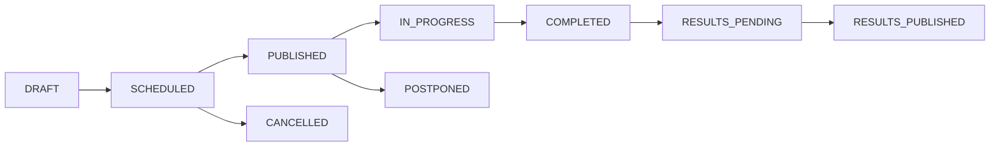

# Managing Exams

Complete guide to scheduling, organizing, and managing examinations with conflict detection, room allocation, and invigilator assignment.

---

## Quick Start

### Creating Your First Exam

1. Navigate to **Exams** → **Create New**
2. Fill in basic information (title, class, subject)
3. Set schedule and marks
4. Add instructions
5. Publish when ready

**Time Required**: 2-5 minutes

---

## Exam Creation Workflow

### Step 1: Basic Information

#### Required Fields

| Field | Description | Example |
|-------|-------------|---------|
| **Title** | Exam name | "Mathematics Midterm 2025" |
| **Description** | Brief overview | "Covers chapters 1-5" |
| **Class** | Target class | "Grade 10-A" |
| **Subject** | Subject being tested | "Mathematics" |
| **Type** | Exam category | Midterm/Final/Quiz/Test/Practical |

#### Best Practices
- Use descriptive titles including year/term
- Add clear descriptions for student reference
- Select correct class to ensure proper enrollment
- Choose appropriate exam type for grading weight

### Step 2: Schedule & Marks

#### Scheduling Options

**Date & Time Configuration:**
```
Start Date: December 15, 2025
Start Time: 09:00 AM
End Time: 11:00 AM
Duration: 2 hours (auto-calculated)
```

**Conflict Detection:**
The system automatically checks for:
- Room availability conflicts
- Teacher scheduling conflicts
- Student exam overlaps
- Timetable clashes

#### Marks Configuration

| Setting | Purpose | Typical Values |
|---------|---------|----------------|
| **Total Marks** | Maximum achievable score | 100, 50, 25 |
| **Passing Marks** | Minimum to pass | 40%, 50% |
| **Weight** | Contribution to final grade | 20%, 30%, 50% |
| **Negative Marking** | For MCQs (optional) | -0.25 per wrong |

### Step 3: Instructions & Settings

#### Student Instructions
```markdown
## Exam Instructions
- Answer all questions
- Show all calculations
- No calculators allowed
- Write clearly in blue or black ink
```

#### Exam Settings

**Security Options:**
- **Randomize Questions**: Different order per student
- **Randomize Options**: Shuffle MCQ choices
- **Show Results**: Immediately/After review/On date
- **Allow Review**: Students can review answers
- **Browser Lock**: Prevent tab switching (online)

**Advanced Settings:**
- Late submission penalty (% per minute)
- Extra time for special needs
- Question navigation (sequential/free)
- Auto-save interval (seconds)

---

## Room Allocation

### Capacity Management

The system automatically calculates room requirements based on:
- Total enrolled students
- Room capacities
- Social distancing requirements (if enabled)
- Buffer percentage (default 80%)

**Example Calculation:**
```
Students: 120
Room A Capacity: 50
Room B Capacity: 50
Room C Capacity: 40

With 80% buffer:
Room A: 40 students
Room B: 40 students
Room C: 32 students
Total: 112 students ✓

Recommendation: Add one more room or adjust
```

### Room Assignment Strategies

#### 1. **Alphabetical Distribution**
Students distributed alphabetically across rooms

#### 2. **Random Distribution**
Random assignment to prevent cheating

#### 3. **Class-based Separation**
Different classes in different rooms

#### 4. **Custom Seating Plan**
Upload specific seating arrangements

### Managing Room Conflicts

When conflicts detected:
1. System suggests alternative rooms
2. Shows available time slots
3. Offers to split exam into sessions
4. Provides conflict resolution wizard

---

## Invigilator Assignment

### Role Types

| Role | Responsibilities | Required |
|------|------------------|----------|
| **Chief Invigilator** | Overall supervision | 1 per exam |
| **Assistant Invigilator** | Room supervision | 1 per room |
| **Reserve Invigilator** | Backup/relief | Optional |
| **Special Needs Assistant** | Support specific students | As needed |

### Assignment Rules

**Automatic Checks:**
- Teacher not teaching the subject (avoid bias)
- Not already assigned to another exam
- Available during exam time
- Proper certification/training

**Load Balancing:**
- Maximum 2 exams per day
- Minimum 1-hour break between duties
- Fair distribution across semester

### Notification System

Invigilators receive:
- Initial assignment email
- 24-hour reminder
- 1-hour reminder
- Post-exam report link

---

## Exam Status Management

### Status Workflow



### Status Actions

| Status | Available Actions | Who Can Act |
|--------|------------------|-------------|
| **Draft** | Edit, Delete, Schedule | Creator |
| **Scheduled** | Edit, Publish, Cancel | Admin, Creator |
| **Published** | Postpone, Add Instructions | Admin |
| **In Progress** | Monitor, Extend Time | Admin, Chief Invigilator |
| **Completed** | Start Marking, View Stats | Teachers |
| **Results Published** | Generate Reports, Appeals | All |

---

## Bulk Operations

### Batch Exam Creation

Create multiple exams efficiently:

1. **From Template:**
   - Select exam template
   - Choose multiple classes
   - System creates one exam per class

2. **From Spreadsheet:**
   ```csv
   Title,Class,Subject,Date,StartTime,Duration,TotalMarks
   Math Midterm,10A,Mathematics,2025-12-15,09:00,120,100
   Math Midterm,10B,Mathematics,2025-12-15,11:00,120,100
   ```

3. **Clone & Modify:**
   - Select existing exam
   - Clone for different classes
   - Adjust dates/times

### Bulk Actions Menu

Select multiple exams for:
- **Publish All**: Release simultaneously
- **Postpone**: Shift dates maintaining gaps
- **Cancel**: With notification to students
- **Export**: Download details as CSV
- **Archive**: Move to archive after semester

---

## Calendar View

### Visual Scheduling

The calendar provides:
- Month/Week/Day views
- Drag-drop rescheduling
- Conflict highlighting
- Room availability overlay
- Teacher schedule view

### Color Coding

| Color | Meaning |
|-------|---------|
| 🟢 Green | Scheduled, no conflicts |
| 🟡 Yellow | Minor conflicts (resolvable) |
| 🔴 Red | Major conflicts (blocking) |
| 🔵 Blue | In progress |
| ⚫ Gray | Completed |

### Quick Actions

Right-click on calendar exam for:
- View details
- Edit schedule
- Assign rooms
- Add invigilators
- Send reminders
- Clone exam

---

## Conflict Resolution

### Types of Conflicts

#### 1. **Room Conflicts**
Same room booked for overlapping times

**Resolution Options:**
- Change room
- Adjust timing
- Split into sessions

#### 2. **Teacher Conflicts**
Teacher double-booked

**Resolution Options:**
- Assign different invigilator
- Swap with another teacher
- Adjust exam timing

#### 3. **Student Conflicts**
Student has multiple exams

**Resolution Options:**
- Reschedule one exam
- Create makeup session
- Extend time between exams

### Conflict Resolution Wizard

When conflicts detected:

1. **Analysis Phase**
   - Identify all conflicts
   - Classify by severity
   - Check dependencies

2. **Solution Generation**
   - System suggests solutions
   - Ranks by impact
   - Shows affected parties

3. **Implementation**
   - Preview changes
   - Confirm modifications
   - Send notifications

---

## Monitoring & Analytics

### Real-time Dashboard

During exams, monitor:
- Attendance (present/absent)
- Submission progress
- Time remaining
- Technical issues
- Invigilator notes

### Post-Exam Analytics

| Metric | Description |
|--------|-------------|
| **Attendance Rate** | % of students who attended |
| **Completion Rate** | % who submitted |
| **Average Time** | Mean completion time |
| **Question Analysis** | Most/least attempted |
| **Difficulty Analysis** | Based on scores |

### Reports Available

1. **Exam Summary Report**
   - Basic statistics
   - Room utilization
   - Invigilator feedback

2. **Detailed Analysis**
   - Question-wise performance
   - Time distribution
   - Score distribution

3. **Comparison Report**
   - Compare with previous exams
   - Class-wise comparison
   - Year-over-year trends

---

## Best Practices

### Scheduling Guidelines

✅ **DO:**
- Schedule at least 1 week in advance
- Allow 30-minute gaps between exams
- Consider prayer times and breaks
- Test room equipment beforehand
- Have backup rooms ready

❌ **DON'T:**
- Schedule during holidays
- Overlap with major events
- Ignore student feedback
- Forget special needs students
- Skip conflict checking

### Communication

**Pre-Exam:**
- Send schedule 1 week prior
- Include room numbers
- Share instructions
- Provide contact for queries

**During Exam:**
- Post room assignments
- Display timer
- Announce time checks
- Handle queries promptly

**Post-Exam:**
- Confirm submission receipt
- Share marking timeline
- Announce result date
- Provide feedback channel

---

## Troubleshooting

### Common Issues

| Issue | Solution |
|-------|----------|
| Cannot create exam | Check permissions, verify class exists |
| Conflict not detected | Refresh, check timezone settings |
| Students not enrolled | Verify class enrollment, sync students |
| Room shows unavailable | Check timetable integration |
| Notifications not sending | Verify email settings, check spam |

### Advanced Troubleshooting

#### Database Sync Issues
```bash
# Force sync exam data
npm run sync:exams

# Rebuild exam indexes
npm run db:reindex:exams
```

#### Permission Problems
Check user has required permissions:
- `exam:create` - Create exams
- `exam:edit` - Modify exams
- `exam:publish` - Publish exams
- `exam:delete` - Delete exams
- `exam:grade` - Access grading

---

## Keyboard Shortcuts

| Shortcut | Action |
|----------|--------|
| `Ctrl+N` | New exam |
| `Ctrl+S` | Save draft |
| `Ctrl+P` | Publish exam |
| `Ctrl+D` | Duplicate exam |
| `Ctrl+/` | Show shortcuts |
| `Esc` | Close dialog |

---

## API Reference

### Create Exam
```typescript
POST /api/exam/manage/create
{
  title: string
  description?: string
  classId: string
  subjectId: string
  type: 'MIDTERM' | 'FINAL' | 'QUIZ' | 'TEST' | 'PRACTICAL'
  startDate: Date
  endDate: Date
  totalMarks: number
  passingMarks: number
  instructions?: string
  settings?: ExamSettings
}
```

### Update Exam
```typescript
PUT /api/exam/manage/update/{examId}
{
  // Partial exam object
}
```

### Get Exam List
```typescript
GET /api/exam/manage/list?page=1&limit=20&status=PUBLISHED
```

---

## Related Documentation

- [Question Bank Management](/docs/exam/question-bank)
- [Auto-Generate Exams](/docs/exam/auto-generate)
- [Marking System](/docs/exam/auto-marking)
- [Results & Analytics](/docs/exam/results-analytics)
- [Troubleshooting Guide](/docs/exam/troubleshooting)