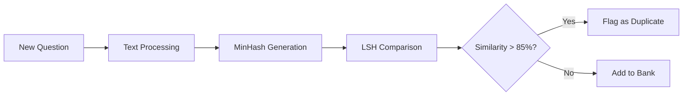

# Question Bank Management

Build and manage a comprehensive repository of exam questions with support for multiple question types, AI generation, and intelligent duplicate detection.

---

## Overview

The Question Bank is your centralized repository for all exam questions, featuring:
- 7+ question types (MCQ, Essay, True/False, etc.)
- AI-powered question generation
- Bloom's taxonomy classification
- Duplicate detection
- Import/Export capabilities
- Performance analytics

---

## Question Types

### 1. Multiple Choice Questions (MCQ)

**Structure:**
```json
{
  "type": "MULTIPLE_CHOICE",
  "text": "What is the capital of France?",
  "options": [
    { "id": "a", "text": "London", "isCorrect": false },
    { "id": "b", "text": "Paris", "isCorrect": true },
    { "id": "c", "text": "Berlin", "isCorrect": false },
    { "id": "d", "text": "Madrid", "isCorrect": false }
  ],
  "marks": 1,
  "explanation": "Paris has been the capital of France since 987 AD."
}
```

**Best Practices:**
- Include 4-5 options
- Make distractors plausible
- Avoid "All of the above"
- One clear correct answer
- Add explanations

### 2. True/False Questions

**Structure:**
```json
{
  "type": "TRUE_FALSE",
  "text": "The Earth orbits around the Sun.",
  "correctAnswer": true,
  "marks": 1,
  "explanation": "The Earth completes one orbit around the Sun in 365.25 days."
}
```

**Guidelines:**
- Avoid negative statements
- Be absolutely clear
- No partially true statements
- Focus on key concepts

### 3. Short Answer Questions

**Structure:**
```json
{
  "type": "SHORT_ANSWER",
  "text": "Name the three states of matter.",
  "correctAnswer": ["solid", "liquid", "gas"],
  "marks": 3,
  "acceptableVariations": ["solids", "liquids", "gases", "plasma"],
  "caseSensitive": false
}
```

**Features:**
- Multiple correct answers
- Variation acceptance
- Partial marking
- Case sensitivity options

### 4. Essay Questions

**Structure:**
```json
{
  "type": "ESSAY",
  "text": "Discuss the causes and effects of climate change.",
  "marks": 10,
  "rubric": {
    "criteria": [
      { "name": "Understanding", "weight": 30 },
      { "name": "Analysis", "weight": 40 },
      { "name": "Examples", "weight": 20 },
      { "name": "Conclusion", "weight": 10 }
    ]
  },
  "minWords": 200,
  "maxWords": 500
}
```

**Grading Options:**
- Rubric-based scoring
- AI-assisted grading
- Keyword detection
- Plagiarism check

### 5. Fill in the Blank

**Structure:**
```json
{
  "type": "FILL_BLANK",
  "text": "The chemical formula for water is _____.",
  "blanks": [
    {
      "position": 1,
      "answer": "H2O",
      "alternatives": ["H₂O"],
      "marks": 1
    }
  ]
}
```

### 6. Matching Questions

**Structure:**
```json
{
  "type": "MATCHING",
  "text": "Match the countries with their capitals:",
  "leftColumn": ["France", "Germany", "Italy", "Spain"],
  "rightColumn": ["Rome", "Berlin", "Madrid", "Paris"],
  "correctPairs": [
    ["France", "Paris"],
    ["Germany", "Berlin"],
    ["Italy", "Rome"],
    ["Spain", "Madrid"]
  ],
  "marks": 4
}
```

### 7. Ordering Questions

**Structure:**
```json
{
  "type": "ORDERING",
  "text": "Arrange the planets from closest to farthest from the Sun:",
  "items": ["Earth", "Mars", "Mercury", "Venus"],
  "correctOrder": ["Mercury", "Venus", "Earth", "Mars"],
  "marks": 4
}
```

---

## Creating Questions

### Manual Creation

#### Step 1: Navigate to Question Bank
```
Exams → Question Bank → Add Question
```

#### Step 2: Fill Question Details

**Required Fields:**

| Field | Description | Example |
|-------|-------------|---------|
| **Type** | Question format | Multiple Choice |
| **Subject** | Subject area | Mathematics |
| **Topic** | Specific topic | Algebra |
| **Text** | Question content | "Solve for x: 2x + 5 = 15" |
| **Marks** | Point value | 2 |
| **Difficulty** | Complexity level | Medium |

**Optional Fields:**

| Field | Purpose |
|-------|---------|
| **Tags** | Searchable keywords |
| **Bloom's Level** | Cognitive classification |
| **Time Estimate** | Expected completion time |
| **Instructions** | Special instructions |
| **Attachments** | Images, diagrams |

#### Step 3: Add Answer Options

For MCQ questions:
1. Add 4-5 options
2. Mark correct answer(s)
3. Add explanations (optional)
4. Set randomization preference

#### Step 4: Classification

**Bloom's Taxonomy Levels:**

| Level | Description | Example Keywords |
|-------|-------------|------------------|
| **Remember** | Recall facts | Define, List, Name |
| **Understand** | Explain concepts | Describe, Explain, Summarize |
| **Apply** | Use knowledge | Calculate, Solve, Demonstrate |
| **Analyze** | Break down | Compare, Contrast, Examine |
| **Evaluate** | Make judgments | Assess, Critique, Justify |
| **Create** | Produce new | Design, Develop, Compose |

**Difficulty Mapping:**
- **Easy**: 70%+ students answer correctly
- **Medium**: 50-70% success rate
- **Hard**: 30-50% success rate
- **Expert**: <30% success rate

---

## AI-Powered Question Generation

### Quick Generation

1. **Navigate to**: Question Bank → AI Generate
2. **Select Parameters**:
   - Subject and topic
   - Number of questions
   - Question types
   - Difficulty distribution
   - Bloom's levels

3. **Review & Edit**: AI generates draft questions
4. **Approve**: Add to question bank

### Advanced Generation

#### From Learning Objectives
```
Input: "Students should be able to calculate compound interest"

Output:
- MCQ on formula identification
- Short answer on calculation
- Essay on real-world application
```

#### From Textbook Content
1. Upload PDF/document
2. System extracts key concepts
3. Generates questions per chapter
4. Maps to curriculum

#### Generation Settings

| Setting | Options | Default |
|---------|---------|---------|
| **Creativity** | Low/Medium/High | Medium |
| **Language Complexity** | Grade-appropriate | Auto-detect |
| **Cultural Context** | Local/International | Local |
| **Include Explanations** | Yes/No | Yes |

---

## Bulk Import

### Supported Formats

#### 1. CSV Import
```csv
Type,Text,Option1,Option2,Option3,Option4,Correct,Marks,Difficulty,Topic,Tags
MCQ,"What is 2+2?",2,3,4,5,3,1,Easy,Addition,"math,basic"
TRUE_FALSE,"The sky is blue",,,,,TRUE,1,Easy,Science,"facts"
```

#### 2. Excel Import (.xlsx)
- Sheet 1: Questions
- Sheet 2: Metadata
- Sheet 3: Rubrics (for essays)

#### 3. QTI Format (Question & Test Interoperability)
```xml
<assessmentItem>
  <responseDeclaration identifier="RESPONSE" cardinality="single">
    <correctResponse>
      <value>A</value>
    </correctResponse>
  </responseDeclaration>
  ...
</assessmentItem>
```

#### 4. GIFT Format (Moodle)
```
::Question Title::
Question text {
  =Correct answer
  ~Wrong answer 1
  ~Wrong answer 2
}
```

### Import Process

1. **Prepare File**: Follow format requirements
2. **Upload**: Drag & drop or browse
3. **Validation**: System checks for errors
4. **Preview**: Review parsed questions
5. **Mapping**: Map fields if needed
6. **Import**: Add to question bank

### Error Handling

| Error | Solution |
|-------|----------|
| Invalid format | Check column headers match template |
| Missing required fields | Add subject, topic, marks |
| Duplicate questions | Review and merge/skip |
| Invalid difficulty | Use: Easy, Medium, Hard, Expert |
| Encoding issues | Save as UTF-8 |

---

## Search & Organization

### Advanced Search

#### Search Operators
- **Exact match**: `"quadratic equation"`
- **Exclude**: `-calculus`
- **OR**: `physics OR chemistry`
- **Wildcard**: `calc*`

#### Filter Options
```typescript
{
  type: ['MCQ', 'ESSAY'],
  difficulty: ['MEDIUM', 'HARD'],
  subject: 'Mathematics',
  topic: 'Algebra',
  tags: ['exam2025', 'midterm'],
  bloomsLevel: ['APPLY', 'ANALYZE'],
  marksRange: [2, 5],
  usageCount: { min: 0, max: 5 },
  createdDate: { from: '2025-01-01', to: '2025-12-31' }
}
```

### Tag Management

#### Creating Tags
- Descriptive: `chapter-5`, `unit-test`
- Categorical: `important`, `optional`
- Temporal: `2025-midterm`, `final-exam`
- Difficulty hints: `tricky`, `basic-concept`

#### Tag Best Practices
- Use consistent naming
- Limit to 5-10 tags per question
- Create tag taxonomy
- Regular cleanup

### Collections

Create question collections for:
- Specific exams
- Practice sets
- Homework assignments
- Revision materials

---

## Duplicate Detection

### How It Works

The system uses advanced algorithms to detect:

1. **Exact Duplicates**: 100% text match
2. **Near Duplicates**: >85% similarity
3. **Semantic Duplicates**: Same meaning, different words

### Detection Process



### Handling Duplicates

When duplicates detected:

1. **Review**: Compare side-by-side
2. **Options**:
   - Skip import
   - Replace existing
   - Merge questions
   - Keep both (tag as variant)

---

## Question Analytics

### Performance Metrics

| Metric | Description | Use Case |
|--------|-------------|----------|
| **Usage Count** | Times used in exams | Identify overused questions |
| **Average Score** | Mean student performance | Assess difficulty accuracy |
| **Discrimination Index** | Differentiates strong/weak students | Quality indicator |
| **Time Spent** | Average completion time | Adjust time allowance |
| **Skip Rate** | % who skip question | Identify problematic questions |

### Analytics Dashboard

View insights on:
- Most/least used questions
- Difficulty distribution
- Topic coverage gaps
- Performance trends
- Quality scores

### Improvement Recommendations

System suggests:
- Questions needing revision
- Difficulty recalibration
- Underused high-quality questions
- Topics needing more questions

---

## Export Options

### Available Formats

#### 1. PDF Export
- Formatted question papers
- Answer keys
- Marking schemes

#### 2. CSV/Excel Export
- Bulk editing
- Backup purposes
- Sharing with colleagues

#### 3. Learning Management Systems
- Moodle XML
- Canvas QTI
- Blackboard format
- Google Forms

### Export Settings

```typescript
{
  format: 'PDF',
  includeAnswers: true,
  includeExplanations: false,
  includeMetadata: true,
  groupBy: 'topic',
  sortBy: 'difficulty',
  questionNumbers: 'sequential'
}
```

---

## Best Practices

### Question Writing Guidelines

✅ **DO:**
- Write clear, unambiguous questions
- Test all questions before using
- Include variety in question types
- Balance difficulty levels
- Add explanations for learning
- Review and update regularly

❌ **DON'T:**
- Use double negatives
- Include trick questions
- Copy from copyrighted sources
- Make culturally biased questions
- Use outdated information
- Create overly complex questions

### Quality Checklist

Before adding questions:
- [ ] Grammar and spelling checked
- [ ] Factually accurate
- [ ] Appropriate difficulty
- [ ] Clear instructions
- [ ] Correct answer verified
- [ ] Explanations provided
- [ ] Tags added
- [ ] Bloom's level assigned

### Maintenance

**Regular Tasks:**
- Review low-performing questions monthly
- Update questions with current information
- Archive outdated questions
- Recalibrate difficulty based on data
- Check for broken image links

---

## API Reference

### Create Question
```typescript
POST /api/exam/qbank/create
{
  type: QuestionType
  text: string
  options?: Option[]
  correctAnswer: string | string[]
  marks: number
  difficulty: 'EASY' | 'MEDIUM' | 'HARD' | 'EXPERT'
  subject: string
  topic: string
  tags: string[]
  bloomsLevel: BloomsLevel
}
```

### Search Questions
```typescript
GET /api/exam/qbank/search?q=algebra&type=MCQ&difficulty=MEDIUM
```

### Bulk Import
```typescript
POST /api/exam/qbank/import
Content-Type: multipart/form-data
{
  file: File
  format: 'CSV' | 'EXCEL' | 'QTI' | 'GIFT'
  options: ImportOptions
}
```

---

## Troubleshooting

### Common Issues

| Issue | Solution |
|-------|----------|
| Import fails | Check file format, encoding (UTF-8) |
| Duplicates not detected | Adjust similarity threshold |
| Search not working | Rebuild search index |
| Images not displaying | Check file paths, permissions |
| Export incomplete | Increase timeout, reduce batch size |

### Performance Optimization

For large question banks (10K+ questions):
- Use pagination (50 per page)
- Enable search indexing
- Archive unused questions
- Optimize images (<500KB)
- Regular database maintenance

---

## Related Documentation

- [Creating Exams](/docs/exam/manage-exams)
- [Auto-Generate from Question Bank](/docs/exam/auto-generate)
- [Marking System](/docs/exam/auto-marking)
- [API Reference](/docs/exam/api-reference)