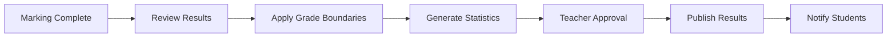

# Results & Analytics

Generate comprehensive reports, analyze performance trends, and produce professional PDF certificates with multiple templates.

---

## Overview

The Results & Analytics module provides:
- **Instant result publication** with controlled visibility
- **Professional PDF reports** with 3 customizable templates
- **Performance analytics** at student, class, and school levels
- **Grade calculations** with curves and boundaries
- **Comparative analysis** across exams and terms
- **Export capabilities** in multiple formats

---

## Result Publication

### Publishing Workflow



### Publication Settings

| Setting | Options | Description |
|---------|---------|-------------|
| **Visibility** | Immediate/Scheduled/Manual | When students can view |
| **Show Answers** | Yes/No/After deadline | Answer key visibility |
| **Show Scores** | Detailed/Total only/Percentage | Score breakdown |
| **Allow Appeals** | Yes/No | Enable grade review requests |
| **Parent Access** | Enabled/Disabled | Parent portal visibility |

### Scheduled Release

```typescript
{
  releaseDate: "2025-12-20T10:00:00",
  notifications: {
    email: true,
    sms: true,
    push: true
  },
  embargo: {
    showRank: false,  // Hide ranking initially
    showAverage: false // Hide class average
  }
}
```

---

## Grade Calculation

### Grade Boundaries

#### Standard Configuration
```typescript
const gradeBoundaries = [
  { grade: "A+", minScore: 90, maxScore: 100, gpa: 4.0 },
  { grade: "A",  minScore: 85, maxScore: 89,  gpa: 3.7 },
  { grade: "B+", minScore: 80, maxScore: 84,  gpa: 3.3 },
  { grade: "B",  minScore: 75, maxScore: 79,  gpa: 3.0 },
  { grade: "C+", minScore: 70, maxScore: 74,  gpa: 2.7 },
  { grade: "C",  minScore: 65, maxScore: 69,  gpa: 2.3 },
  { grade: "D",  minScore: 50, maxScore: 64,  gpa: 1.0 },
  { grade: "F",  minScore: 0,  maxScore: 49,  gpa: 0.0 }
];
```

#### Custom Boundaries
- Per subject configuration
- Curved grading
- Percentile-based
- Pass/Fail only

### Grade Calculation Methods

#### 1. **Absolute Grading**
Direct percentage to grade mapping
```typescript
function calculateAbsoluteGrade(score: number, total: number): string {
  const percentage = (score / total) * 100;
  return getGradeFromBoundaries(percentage);
}
```

#### 2. **Curve Grading**
Adjust based on class performance
```typescript
function calculateCurvedGrade(score: number, mean: number, stdDev: number): string {
  const zScore = (score - mean) / stdDev;
  return getGradeFromZScore(zScore);
}
```

#### 3. **Weighted Average**
Multiple components with weights
```typescript
function calculateWeightedGrade(components: GradeComponent[]): number {
  return components.reduce((total, comp) =>
    total + (comp.score * comp.weight), 0
  );
}
```

### Rank Calculation

```typescript
interface RankingResult {
  studentRank: number;
  totalStudents: number;
  percentile: number;
  classRank: number;
  sectionRank?: number;
  subjectRank?: number;
}
```

---

## PDF Report Generation

### Available Templates

#### 1. Classic Template
**Professional formal report card**

Features:
- School letterhead and logo
- Formal typography
- Tabular grade presentation
- Official signatures
- Watermark support

Best for:
- Official transcripts
- Board examinations
- Parent meetings
- Archives

#### 2. Modern Template
**Visual design with charts**

Features:
- Colorful design
- Performance graphs
- Progress indicators
- QR code for verification
- Mobile-optimized

Best for:
- Regular assessments
- Student portfolios
- Digital sharing
- Progress reports

#### 3. Minimal Template
**Clean text-based layout**

Features:
- Simple typography
- Efficient space usage
- Fast generation
- Small file size
- Printer-friendly

Best for:
- Quick reports
- Bulk printing
- Email attachments
- Low-bandwidth areas

### PDF Customization

#### Header Configuration
```typescript
{
  logo: "/school-logo.png",
  schoolName: "Hogwarts School",
  address: "123 Education St",
  phone: "+1234567890",
  email: "info@school.edu",
  website: "www.school.edu"
}
```

#### Content Sections
- Student information
- Exam details
- Subject-wise scores
- Grade summary
- Attendance record
- Teacher remarks
- Parent signature

#### Footer Options
- Page numbers
- Generation date
- Verification code
- Terms and conditions

### Batch PDF Generation

#### Process Flow
1. Select students/class
2. Choose template
3. Configure options
4. Generate PDFs
5. Download as ZIP

#### Performance Optimization
```typescript
{
  batchSize: 50,        // PDFs per batch
  parallel: 4,          // Concurrent generations
  compression: true,    // ZIP compression
  quality: "high",      // Image quality
  timeout: 30000        // 30 seconds per PDF
}
```

---

## Analytics Dashboard

### Student Analytics

#### Individual Performance
```
Overall Score: 425/500 (85%)
Grade: A
Class Rank: 5/45
Percentile: 89th

Subject Performance:
Mathematics: 92% (A+)
Science: 88% (A)
English: 82% (B+)
History: 78% (B)
```

#### Progress Tracking
- Score trends over time
- Subject-wise improvement
- Strengths and weaknesses
- Comparative performance

### Class Analytics

#### Distribution Metrics
```
Mean: 72.5%
Median: 74%
Mode: 76%
Standard Deviation: 12.3
Skewness: -0.4
```

#### Visual Representations

| Chart Type | Purpose |
|------------|---------|
| **Histogram** | Score distribution |
| **Box Plot** | Quartiles and outliers |
| **Line Chart** | Trends over time |
| **Radar Chart** | Subject comparison |
| **Heat Map** | Topic performance |

### Subject Analytics

#### Question Analysis
- Difficulty index per question
- Discrimination power
- Time spent distribution
- Common mistakes

#### Topic Performance
```typescript
{
  topics: [
    { name: "Algebra", avgScore: 78, attempted: 45 },
    { name: "Geometry", avgScore: 82, attempted: 45 },
    { name: "Calculus", avgScore: 65, attempted: 43 }
  ]
}
```

### Comparative Analytics

#### Exam Comparison
Compare current exam with:
- Previous exams
- Same exam last year
- School average
- District/National average

#### Cohort Analysis
Track performance across:
- Different sections
- Gender groups
- Age groups
- Entry year cohorts

---

## Report Types

### 1. Individual Report Card

**Sections:**
- Personal details
- Academic performance
- Subject-wise grades
- Attendance summary
- Achievements
- Teacher comments
- Next steps

### 2. Progress Report

**Tracks:**
- Term-wise performance
- Improvement areas
- Goal achievement
- Behavioral assessment
- Extracurricular activities

### 3. Diagnostic Report

**Analyzes:**
- Learning gaps
- Concept mastery
- Skill development
- Remedial needs
- Enrichment opportunities

### 4. Comparative Report

**Compares:**
- With class average
- Previous performance
- Expected outcomes
- Peer performance

### 5. Parent Report

**Includes:**
- Summary for parents
- Home support suggestions
- Meeting requests
- Resource recommendations

---

## Export Options

### Data Export Formats

#### CSV Export
```csv
StudentID,Name,Subject,Score,Grade,Rank
STU001,"John Doe",Math,92,A+,3
STU001,"John Doe",Science,88,A,5
```

#### Excel Export
Multiple sheets:
- Summary
- Detailed scores
- Analytics
- Charts

#### JSON Export
```json
{
  "examId": "exam-123",
  "results": [
    {
      "studentId": "STU001",
      "scores": {
        "math": 92,
        "science": 88
      },
      "grade": "A",
      "rank": 3
    }
  ]
}
```

### Integration Exports

#### LMS Integration
- Moodle gradebook
- Canvas grades
- Google Classroom
- Microsoft Teams

#### SIS Integration
- PowerSchool
- Infinite Campus
- Skyward
- Custom APIs

---

## Performance Optimization

### Calculation Optimization

#### Caching Strategy
```typescript
const cacheConfig = {
  gradeCalculations: 3600,    // 1 hour
  rankings: 1800,              // 30 minutes
  statistics: 600,             // 10 minutes
  pdfTemplates: 86400          // 24 hours
};
```

#### Batch Processing
- Process in chunks of 100
- Parallel calculations
- Async operations
- Progress indicators

### Query Optimization

#### Efficient Data Fetching
```typescript
// Optimized query with single join
const results = await db.examResult.findMany({
  where: { examId },
  include: {
    student: {
      select: { id: true, name: true, rollNumber: true }
    },
    exam: {
      include: {
        gradeBoundaries: true
      }
    }
  }
});
```

---

## Analytics Formulas

### Statistical Calculations

#### Mean (Average)
```typescript
mean = Σ(scores) / n
```

#### Standard Deviation
```typescript
σ = √(Σ(x - mean)² / n)
```

#### Percentile Rank
```typescript
percentile = (rank / totalStudents) * 100
```

#### Z-Score
```typescript
z = (score - mean) / standardDeviation
```

#### Correlation Coefficient
```typescript
r = Σ((x - x̄)(y - ȳ)) / √(Σ(x - x̄)² * Σ(y - ȳ)²)
```

### Grade Calculations

#### GPA Calculation
```typescript
GPA = Σ(gradePoints * creditHours) / Σ(creditHours)
```

#### Weighted Score
```typescript
weightedScore = Σ(componentScore * componentWeight)
```

---

## Best Practices

### Result Management

✅ **DO:**
- Verify all marks before publishing
- Test PDF generation with samples
- Configure grade boundaries early
- Provide detailed feedback
- Archive results regularly
- Monitor analytics trends

❌ **DON'T:**
- Publish without review
- Change boundaries after publishing
- Delete original data
- Share individual comparisons publicly
- Ignore statistical anomalies

### Data Privacy

**Student Data Protection:**
- Encrypt sensitive data
- Role-based access control
- Audit trail for changes
- Secure PDF generation
- GDPR/FERPA compliance

### Quality Assurance

**Before Publishing:**
- [ ] All marks entered
- [ ] Grade boundaries set
- [ ] Statistics calculated
- [ ] PDFs generated successfully
- [ ] Notifications configured
- [ ] Appeals process ready

---

## Troubleshooting

### Common Issues

| Issue | Solution |
|-------|----------|
| PDF generation fails | Check template, reduce batch size |
| Wrong grade calculation | Verify boundaries, check formula |
| Missing students | Sync enrollment, check filters |
| Export timeout | Reduce data size, use pagination |
| Charts not displaying | Check data format, browser compatibility |

### Performance Issues

**Slow PDF Generation:**
```bash
# Increase memory allocation
NODE_OPTIONS="--max-old-space-size=4096" npm run generate-pdfs

# Use queue processing
npm run pdfs:queue --batch-size=25
```

**Large Dataset Handling:**
```typescript
// Use cursor-based pagination
const results = await getResultsPaginated({
  cursor: lastId,
  take: 100
});
```

---

## API Reference

### Publish Results
```typescript
POST /api/exam/results/publish
{
  examId: string
  settings: PublicationSettings
}
```

### Generate PDF
```typescript
POST /api/exam/results/pdf
{
  studentId: string
  examId: string
  template: 'classic' | 'modern' | 'minimal'
  options: PDFOptions
}
```

### Batch PDF Generation
```typescript
POST /api/exam/results/pdf/batch
{
  examId: string
  studentIds: string[]
  template: string
  compression: boolean
}
```

### Get Analytics
```typescript
GET /api/exam/results/analytics/{examId}
```

### Export Results
```typescript
POST /api/exam/results/export
{
  examId: string
  format: 'csv' | 'excel' | 'json'
  includeAnalytics: boolean
}
```

---

## Related Documentation

- [Managing Exams](/docs/exam/manage-exams)
- [Auto-Marking System](/docs/exam/auto-marking)
- [API Reference](/docs/exam/api-reference)
- [Troubleshooting Guide](/docs/exam/troubleshooting)