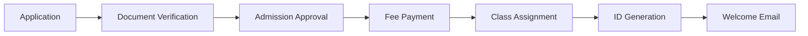

# Student Management

Comprehensive student information system for managing student profiles, enrollment, academic records, and more.

## Overview

The Student Management module is the backbone of Hogwarts, providing a centralized system to manage all student-related information throughout their academic journey. From admission to graduation, every aspect of student data is organized, accessible, and secure.

## Key Features

### 📋 Student Profiles

Complete student information management including:

- **Personal Information**
  - Full name (first, middle, last)
  - Date of birth and age calculation
  - Gender and blood group
  - Nationality and religion
  - Profile photo management
  - Unique student ID generation

- **Contact Details**
  - Primary email and phone
  - Current address
  - Permanent address
  - Emergency contacts
  - Parent/guardian information

- **Academic Information**
  - Current class and section
  - Roll number
  - Registration number
  - Admission date
  - Previous school records
  - Academic history

### 🎓 Enrollment Management

Streamlined enrollment process:

- **New Admissions**
  - Online application forms
  - Document verification
  - Admission approval workflow
  - Automatic ID generation
  - Welcome email automation

- **Class Assignment**
  - Batch allocation
  - Section assignment
  - Subject selection
  - Elective management
  - Stream/branch selection

- **Transfer Management**
  - Inter-class transfers
  - Branch changes
  - School transfer certificates
  - Academic record migration

### 📚 Academic Records

Comprehensive academic tracking:

- **Performance History**
  - Exam results archive
  - Grade progression
  - Subject-wise performance
  - Yearly transcripts
  - Achievement certificates

- **Documents Management**
  - Birth certificate
  - Previous school records
  - Transfer certificates
  - Medical records
  - Achievement documents
  - Custom document types

- **Health Records**
  - Medical history
  - Vaccination records
  - Allergies and conditions
  - Emergency medical info
  - Insurance details

## User Interface

### Student List View

The main student management interface provides:

```
┌─────────────────────────────────────────────────────────┐
│ Students                                    + Add Student│
├─────────────────────────────────────────────────────────┤
│ 🔍 Search students...          Filter ▼    Export ▼      │
├─────────────────────────────────────────────────────────┤
│ □ | ID    | Name      | Class | Section | Status    | ⚙ │
│ □ | S001  | John Doe  | 10th  | A       | Active    | ⋮ │
│ □ | S002  | Jane Smith| 10th  | B       | Active    | ⋮ │
│ □ | S003  | Bob Wilson| 9th   | A       | Inactive  | ⋮ │
├─────────────────────────────────────────────────────────┤
│ Showing 1-10 of 500          < Previous  1 2 3  Next >  │
└─────────────────────────────────────────────────────────┘
```

### Student Detail View

Detailed student profile with tabs:

```
┌─────────────────────────────────────────────────────────┐
│ John Doe - S001                          Edit | Delete  │
├─────────────────────────────────────────────────────────┤
│ [Overview] [Academic] [Attendance] [Fees] [Documents]   │
├─────────────────────────────────────────────────────────┤
│ Personal Information          Academic Information       │
│ ┌──────────┐                                           │
│ │  [Photo]  │ Name: John Doe    Class: 10th-A         │
│ │          │ DOB: 01/01/2008   Roll No: 15            │
│ └──────────┘ Gender: Male      Status: Active         │
│              Phone: +1234567890                        │
│              Email: john@school.edu                    │
└─────────────────────────────────────────────────────────┘
```

## Workflows

### New Student Registration



### Bulk Import Process

1. **Download Template** - Get CSV/Excel template
2. **Prepare Data** - Fill student information
3. **Upload File** - Import through interface
4. **Validation** - System validates data
5. **Review** - Preview and fix errors
6. **Confirm** - Complete import process

## Features in Detail

### Search & Filters

Advanced search capabilities:

- **Quick Search** - Name, ID, phone, email
- **Advanced Filters**
  - By class and section
  - By admission year
  - By status (active/inactive)
  - By gender
  - By age range
  - By fee status
  - Custom field filters

### Bulk Operations

Perform actions on multiple students:

- **Bulk Update**
  - Class promotion
  - Section changes
  - Status updates
  - Fee assignment

- **Bulk Export**
  - Excel/CSV export
  - PDF reports
  - Custom templates
  - Filtered exports

- **Bulk Communication**
  - SMS to selected students
  - Email notifications
  - Report card distribution
  - Parent alerts

### Student Status Management

Different student statuses:

| Status | Description | Capabilities |
|--------|-------------|--------------|
| **Active** | Currently enrolled | Full access to all features |
| **Inactive** | Temporarily suspended | Limited access, records maintained |
| **Graduated** | Completed studies | Alumni access, historical records |
| **Transferred** | Moved to another school | Read-only records, transfer certificate |
| **Dropped** | Discontinued studies | Archived records, no access |

### Document Management

Comprehensive document handling:

- **Upload Documents**
  - Multiple file formats (PDF, JPG, PNG, DOC)
  - Size limits per document
  - Automatic compression
  - Secure storage

- **Document Categories**
  - Academic certificates
  - Identity proofs
  - Medical records
  - Achievement certificates
  - Custom categories

- **Access Control**
  - Role-based viewing
  - Download permissions
  - Sharing restrictions
  - Audit trail

## Reporting & Analytics

### Standard Reports

- Student strength report
- Class-wise distribution
- Gender analysis
- Age distribution
- Admission trends
- Geographic distribution

### Custom Reports

Create custom reports with:
- Flexible field selection
- Multiple filter criteria
- Various output formats
- Scheduled generation
- Email delivery

### Analytics Dashboard

Visual insights including:
- Enrollment trends
- Retention rates
- Performance metrics
- Demographic analysis
- Comparative studies

## Integration Points

### External Systems

- **SMS Gateway** - Automated notifications
- **Email Service** - Communication and alerts
- **Payment Gateway** - Fee integration
- **Biometric System** - Attendance linking
- **Library System** - Book issue tracking

### Data Exchange

- **Import Formats** - CSV, Excel, JSON
- **Export Options** - PDF, Excel, CSV
- **API Access** - RESTful endpoints
- **Webhooks** - Real-time updates

## Security & Permissions

### Role-Based Access

| Role | View | Add | Edit | Delete | Export |
|------|------|-----|------|--------|---------|
| Admin | ✅ | ✅ | ✅ | ✅ | ✅ |
| Teacher | ✅ | ❌ | Limited | ❌ | ✅ |
| Student | Own | ❌ | ❌ | ❌ | ❌ |
| Parent | Child | ❌ | ❌ | ❌ | ❌ |

### Data Protection

- Encrypted sensitive data
- Audit logs for all changes
- Role-based field visibility
- GDPR compliance options
- Data retention policies

## Best Practices

### Data Entry

1. **Complete Profiles** - Fill all mandatory fields
2. **Verify Information** - Double-check critical data
3. **Regular Updates** - Keep information current
4. **Document Upload** - Maintain digital records
5. **Parent Linking** - Connect family accounts

### Maintenance

- Regular data audits
- Duplicate detection
- Archive old records
- Backup procedures
- Update verification

## Troubleshooting

### Common Issues

**Cannot add student**
- Check mandatory fields
- Verify unique ID
- Ensure class exists
- Check user permissions

**Import failing**
- Validate data format
- Check for duplicates
- Verify required fields
- Review error log

**Search not working**
- Clear filters
- Check index status
- Verify permissions
- Refresh cache

## Related Features

- [Attendance Management](/docs/features/attendance)
- [Examination System](/docs/features/examinations)
- [Fee Management](/docs/features/fees)
- [Parent Portal](/docs/parents/portal)
- [Library Management](/docs/features/library)

## API Reference

### Endpoints

```http
GET    /api/students          # List all students
GET    /api/students/:id      # Get specific student
POST   /api/students          # Create new student
PUT    /api/students/:id      # Update student
DELETE /api/students/:id      # Delete student
POST   /api/students/import   # Bulk import
GET    /api/students/export   # Export data
```

### Example Request

```javascript
// Get student by ID
fetch('/api/students/S001', {
  method: 'GET',
  headers: {
    'Authorization': 'Bearer token',
    'Content-Type': 'application/json'
  }
})
```

## Video Tutorials

- [Adding New Students](https://youtube.com/watch?v=xxx)
- [Bulk Import Guide](https://youtube.com/watch?v=xxx)
- [Managing Student Records](https://youtube.com/watch?v=xxx)
- [Generating Reports](https://youtube.com/watch?v=xxx)

---

**Need help?** Check our [FAQ](/docs/support/faq) or [contact support](/docs/support/contact).