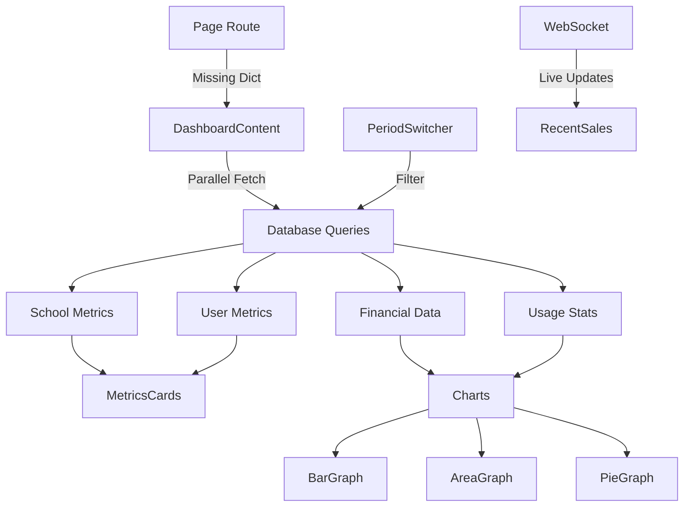

# Dashboard Component

## Overview

The dashboard component provides real-time analytics and metrics visualization for the Hogwarts SaaS platform operators. It displays key performance indicators (KPIs), usage trends, financial metrics, and system health status in an intuitive, data-rich interface.

## Architecture

### Directory Structure
```
dashboard/
├── content.tsx              # Main server component composition ✅
├── area-graph.tsx          # Area chart for trends
├── area-graph-skeleton.tsx # Loading skeleton for area chart
├── bar-graph.tsx           # Bar chart for comparisons
├── bar-graph-skeleton.tsx  # Loading skeleton for bar chart
├── card.tsx                # Metric card component
├── config.ts               # Dashboard configuration
├── metrics-cards.tsx       # KPI cards grid
├── overview.tsx            # Overview section
├── period-switcher.tsx     # Time period selector
├── pie-graph.tsx           # Pie chart for distributions
├── pie-graph-skeleton.tsx  # Loading skeleton for pie chart
├── recent-sales.tsx        # Recent transactions list
└── recent-sales-skeleton.tsx # Loading skeleton for sales
```

### Mirror Pattern Compliance
✅ Correctly follows the mirror pattern with `/[lang]/(operator)/dashboard` route mapping to `/components/operator/dashboard/`

⚠️ **Issue**: The route page doesn't pass the dictionary prop to the content component

## Components

### Main Component

#### `<DashboardContent />`
**Type**: Server Component ✅
**Location**: `content.tsx`
**Purpose**: Orchestrates dashboard data fetching and layout

```typescript
export async function DashboardContent() {
  const [totalSchools, activeSchools, totalUsers, totalStudents] = await Promise.all([
    db.school.count(),
    db.school.count({ where: { isActive: true } }),
    db.user.count(),
    db.student.count(),
  ]);

  return (
    <div className="flex flex-1 flex-col space-y-6">
      <PeriodSwitcher />
      <MetricsCards totals={{ totalSchools, activeSchools, totalUsers, totalStudents }} />
      <BarGraph />
      <RecentSales />
      <div className="flex gap-6 w-full justify-between">
        <AreaGraph />
        <PieGraph />
      </div>
    </div>
  );
}
```

### Chart Components

#### `<BarGraph />`
**Type**: Client Component
**Purpose**: Displays comparative metrics across time periods

**Features**:
- Interactive chart with Recharts
- Theme-aware colors
- Mobile responsive
- Export functionality
- Real-time updates

**Props**:
```typescript
interface BarGraphProps {
  data?: ChartData[];
  period?: 'day' | 'week' | 'month' | 'year';
  height?: number;
}
```

#### `<AreaGraph />`
**Type**: Client Component
**Purpose**: Shows trend data over time with filled area visualization

**Features**:
- Gradient fills
- Multiple series support
- Zoom and pan capabilities
- Custom tooltips

#### `<PieGraph />`
**Type**: Client Component
**Purpose**: Displays distribution of categorical data

**Features**:
- Animated segments
- Interactive legends
- Percentage labels
- Drill-down capability

### Metric Components

#### `<MetricsCards />`
**Type**: Server Component
**Purpose**: Grid of KPI cards showing key metrics

```typescript
interface MetricsCardsProps {
  totals: {
    totalSchools: number;
    activeSchools: number;
    totalUsers: number;
    totalStudents: number;
  };
}
```

**Metrics Displayed**:
- Total Schools
- Active Schools
- Total Users
- Total Students
- Revenue (planned)
- Growth Rate (planned)

#### `<Card />`
**Type**: Reusable Component
**Purpose**: Individual metric card with trend indicator

```typescript
interface CardProps {
  title: string;
  value: string | number;
  description?: string;
  trend?: {
    value: number;
    isPositive: boolean;
  };
  icon?: React.ReactNode;
}
```

### Support Components

#### `<PeriodSwitcher />`
**Type**: Client Component
**Purpose**: Time period selector for filtering data

**Options**:
- Last 24 hours
- Last 7 days
- Last 30 days
- Last 3 months
- Last 12 months
- Custom range

#### `<RecentSales />`
**Type**: Server/Client Hybrid
**Purpose**: List of recent financial transactions

**Features**:
- Real-time updates via SSE
- Transaction details
- Status indicators
- Quick actions

## Data Flow



## TypeScript Patterns

### Type Definitions

```typescript
// Chart data types
interface ChartDataPoint {
  timestamp: Date;
  value: number;
  label: string;
  metadata?: Record<string, unknown>;
}

interface ChartSeries {
  name: string;
  data: ChartDataPoint[];
  color: string;
  type: 'line' | 'area' | 'bar';
}

// Metric types
interface Metric {
  id: string;
  label: string;
  value: number;
  format: (value: number) => string;
  trend?: TrendData;
  target?: number;
}

interface TrendData {
  direction: 'up' | 'down' | 'stable';
  percentage: number;
  previousValue: number;
}

// Dashboard configuration
interface DashboardConfig {
  refreshInterval: number;
  defaultPeriod: Period;
  metrics: MetricConfig[];
  charts: ChartConfig[];
}

type Period = 'day' | 'week' | 'month' | 'quarter' | 'year';
```

### Data Fetching Patterns

```typescript
// Parallel data fetching with error handling
export async function getDashboardData() {
  const results = await Promise.allSettled([
    getSchoolMetrics(),
    getUserMetrics(),
    getFinancialMetrics(),
    getUsageMetrics()
  ]);

  return {
    schools: results[0].status === 'fulfilled' ? results[0].value : null,
    users: results[1].status === 'fulfilled' ? results[1].value : null,
    financial: results[2].status === 'fulfilled' ? results[2].value : null,
    usage: results[3].status === 'fulfilled' ? results[3].value : null
  };
}

// Efficient aggregation queries
async function getSchoolMetrics() {
  const [total, active, trial, paid] = await db.$transaction([
    db.school.count(),
    db.school.count({ where: { isActive: true } }),
    db.school.count({ where: { planType: 'TRIAL' } }),
    db.school.count({ where: { planType: { in: ['BASIC', 'PREMIUM'] } } })
  ]);

  return { total, active, trial, paid };
}
```

## ShadCN UI Components

### Used Components
- `Card`, `CardHeader`, `CardContent`, `CardTitle`, `CardDescription`
- `Select`, `SelectTrigger`, `SelectContent`, `SelectItem`
- `Skeleton` - Loading states
- `Tabs`, `TabsList`, `TabsTrigger`, `TabsContent`
- `HoverCard`, `HoverCardTrigger`, `HoverCardContent`
- `Badge` - Status indicators
- `ScrollArea` - Scrollable containers
- `Separator` - Visual dividers

### Chart Implementation with ShadCN

```tsx
import { Card, CardContent, CardDescription, CardHeader, CardTitle } from "@/components/ui/card";
import { ChartContainer, ChartTooltip, ChartTooltipContent } from "@/components/ui/chart";

export function BarGraph() {
  return (
    <Card>
      <CardHeader>
        <CardTitle>Revenue Overview</CardTitle>
        <CardDescription>Monthly revenue for the last 12 months</CardDescription>
      </CardHeader>
      <CardContent>
        <ChartContainer config={chartConfig} className="h-[350px]">
          <BarChart data={data}>
            <CartesianGrid strokeDasharray="3 3" className="stroke-muted" />
            <XAxis dataKey="month" className="text-xs" />
            <YAxis className="text-xs" />
            <ChartTooltip content={<ChartTooltipContent />} />
            <Bar dataKey="revenue" fill="oklch(var(--chart-1))" />
          </BarChart>
        </ChartContainer>
      </CardContent>
    </Card>
  );
}
```

## Testing

### Unit Tests
```bash
pnpm test src/components/operator/lab/**/*.test.tsx
```

### Test Coverage Areas
- Data aggregation accuracy
- Chart rendering with various data sets
- Period switching functionality
- Metric calculation correctness
- Skeleton loading states
- Error boundary behavior

### Example Tests

```typescript
describe('Dashboard Metrics', () => {
  it('should calculate growth percentage correctly', () => {
    const current = 150;
    const previous = 100;
    const growth = calculateGrowth(current, previous);
    expect(growth).toBe(50);
  });

  it('should handle zero division in growth calculation', () => {
    const growth = calculateGrowth(100, 0);
    expect(growth).toBe(100);
  });

  it('should format large numbers correctly', () => {
    expect(formatMetricValue(1234567)).toBe('1.23M');
    expect(formatMetricValue(1234)).toBe('1,234');
  });
});

describe('Chart Components', () => {
  it('should render with empty data gracefully', () => {
    render(<BarGraph data={[]} />);
    expect(screen.getByText('No data available')).toBeInTheDocument();
  });
});
```

## Performance Optimizations

### Data Caching
```typescript
// Redis caching for expensive queries
const CACHE_KEYS = {
  metrics: 'lab:metrics:{period}',
  charts: 'lab:charts:{type}:{period}',
  recent: 'lab:recent-sales'
};

const CACHE_TTL = {
  metrics: 60,    // 1 minute for real-time metrics
  charts: 300,    // 5 minutes for chart data
  recent: 30      // 30 seconds for recent sales
};
```

### Query Optimization
```sql
-- Optimized query for period metrics
WITH period_data AS (
  SELECT
    DATE_TRUNC('day', created_at) as period,
    COUNT(*) as count,
    SUM(amount) as total
  FROM invoices
  WHERE created_at >= NOW() - INTERVAL '30 days'
  GROUP BY 1
)
SELECT * FROM period_data ORDER BY period DESC;

-- Index for performance
CREATE INDEX idx_invoices_created_amount ON invoices(created_at DESC, amount);
```

### Component Optimization
```typescript
// Memoize expensive calculations
const chartData = useMemo(() =>
  processChartData(rawData, period),
  [rawData, period]
);

// Virtualize long lists
import { VirtualList } from '@tanstack/react-virtual';

// Lazy load heavy components
const BarGraph = dynamic(() => import('./bar-graph'), {
  loading: () => <BarGraphSkeleton />,
  ssr: false
});
```

## Real-Time Updates

### WebSocket Integration
```typescript
// Real-time metric updates
useEffect(() => {
  const ws = new WebSocket(process.env.NEXT_PUBLIC_WS_URL);

  ws.on('metrics:update', (data) => {
    updateMetrics(data);
  });

  ws.on('sales:new', (sale) => {
    addRecentSale(sale);
  });

  return () => ws.close();
}, []);
```

### Server-Sent Events
```typescript
// Alternative SSE implementation
const eventSource = new EventSource('/api/operator/lab/stream');

eventSource.onmessage = (event) => {
  const data = JSON.parse(event.data);
  updateDashboard(data);
};
```

## Monitoring & Alerts

### Dashboard-Specific Metrics
- Page load time
- Data fetch duration
- Chart render performance
- WebSocket connection stability
- Cache hit ratio

### Alert Configuration
```yaml
alerts:
  - name: "Dashboard Load Time"
    threshold: "3s"
    severity: "warning"

  - name: "Real-time Updates Lag"
    threshold: "5s"
    severity: "critical"

  - name: "Chart Render Failure"
    threshold: "3 failures in 5min"
    severity: "warning"
```

## Environment Variables

```bash
# Dashboard Configuration
DASHBOARD_REFRESH_INTERVAL=60000  # 1 minute
DEFAULT_DASHBOARD_PERIOD=week
ENABLE_REALTIME_UPDATES=true

# Chart Configuration
CHART_ANIMATION_DURATION=750
CHART_COLOR_SCHEME=oklch
MAX_CHART_DATA_POINTS=100

# Performance
ENABLE_DASHBOARD_CACHE=true
DASHBOARD_CACHE_TTL=60
PARALLEL_QUERY_LIMIT=10

# WebSocket
NEXT_PUBLIC_WS_URL=wss://ws.databayt.org
WS_HEARTBEAT_INTERVAL=30000
```

## Accessibility Features

- **Keyboard Navigation**: All interactive elements accessible via keyboard
- **Screen Reader Support**: Proper ARIA labels and live regions
- **Color Contrast**: WCAG AAA compliant color schemes
- **Data Tables**: Alternative text representations of charts
- **Focus Management**: Clear focus indicators
- **Reduced Motion**: Respects prefers-reduced-motion

## Mobile Optimization

- **Responsive Grid**: Adapts from 4 columns to 1 on mobile
- **Touch Gestures**: Swipe support for chart interactions
- **Optimized Charts**: Simplified visualizations on small screens
- **Progressive Loading**: Critical metrics load first
- **Offline Support**: Service worker caches recent data

## Future Enhancements

1. **Custom Dashboards**: User-configurable widget layouts
2. **Advanced Analytics**: Predictive trends and anomaly detection
3. **Export Capabilities**: PDF/PNG export of dashboard views
4. **Drill-Down Reports**: Click-through to detailed reports
5. **Comparison Mode**: Side-by-side period comparisons
6. **AI Insights**: Automated insights and recommendations
7. **Alerting System**: Threshold-based notifications
8. **Multi-Display Support**: TV/Wall display mode

## Related Documentation

- [Metrics Configuration](./config.ts)
- [Chart Components Guide](../../../ui/chart.tsx)
- [Data Fetching Patterns](../lib/data-fetching.ts)
- [Real-time Updates](../lib/websocket.ts)
- [Performance Monitoring](../observability/README.md)