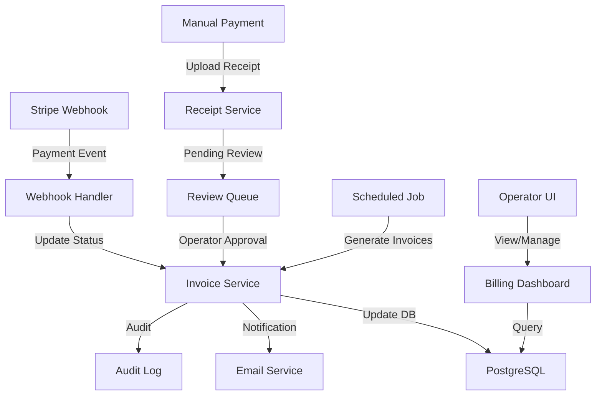

# Billing Component

## Overview

The billing component manages financial operations for the Hogwarts multi-tenant SaaS platform. It handles invoice management, receipt processing, payment tracking, and financial reporting for all tenant schools. This is a critical component that directly impacts revenue operations.

## Architecture

### Directory Structure

```
billing/
├── actions.ts          # Server actions for billing operations
├── columns.tsx         # Table column definitions for invoices
├── table.tsx          # Invoice data table component
├── types.ts           # TypeScript type definitions
├── validation.ts      # Zod schemas for data validation
├── hooks/
│   └── use-billing.ts # Custom hooks for billing logic
├── receipts/
│   ├── columns.tsx    # Receipt table columns
│   ├── table.tsx      # Receipt data table
│   ├── upload.tsx     # Receipt upload component
│   └── validation.ts  # Receipt validation schemas
└── __tests__/
    └── actions.test.ts # Unit tests for billing actions
```

### Mirror Pattern Compliance

✅ Follows the mirror pattern with routes at `/[lang]/(operator)/billing` mapping to components in `/components/operator/billing/`

## Components

### Main Components

#### `<BillingContent />`

**Status**: ⚠️ Client component (should be server component)
**Location**: Not implemented yet
**Purpose**: Main billing dashboard composition

**Recommended Implementation**:

```typescript
// content.tsx (Server Component)
export default async function BillingContent({
  dictionary,
  lang
}: BillingContentProps) {
  const [invoices, receipts, stats] = await Promise.all([
    getInvoices(),
    getPendingReceipts(),
    getBillingStats()
  ]);

  return (
    <div className="space-y-6">
      <BillingStats stats={stats} dictionary={dictionary} />
      <InvoiceTable data={invoices} />
      <ReceiptQueue receipts={receipts} />
    </div>
  );
}
```

#### `<InvoiceTable />`

Client component for displaying and managing invoices.

**Props**:

```typescript
interface InvoiceTableProps {
  data: Invoice[]
  columns: ColumnDef<Invoice>[]
  pageCount: number
}
```

**Features**:

- Sortable columns
- Filterable by status, date, amount
- Pagination
- Bulk operations
- Export functionality

#### `<ReceiptUpload />`

Handles manual receipt uploads for offline payments.

**Props**:

```typescript
interface ReceiptUploadProps {
  invoiceId: string
  schoolId: string
  onUploadComplete: (receipt: Receipt) => void
}
```

**Features**:

- Drag-and-drop file upload
- File type validation (PDF, PNG, JPG)
- Progress indication
- Automatic OCR processing (future)

### Sub-Components

#### `receipts/table.tsx`

Data table for receipt management with approval workflow.

#### `receipts/columns.tsx`

Column definitions with actions for approve/reject.

## API Reference

### Server Actions

#### `createInvoice()`

Creates a new invoice for a school.

```typescript
export async function createInvoice(input: CreateInvoiceInput) {
  // Validates input with Zod
  // Creates invoice in database
  // Sends email notification
  // Returns: ActionResult<Invoice>
}
```

#### `updateInvoiceStatus()`

Updates invoice status with audit logging.

```typescript
export async function updateInvoiceStatus(
  invoiceId: string,
  status: InvoiceStatus
) {
  // Validates status transition
  // Updates database
  // Creates audit log
  // Triggers webhooks
  // Returns: ActionResult<Invoice>
}
```

#### `approveReceipt()`

Approves a manually uploaded receipt.

```typescript
export async function approveReceipt(
  receiptId: string,
  approvedAmount?: number
) {
  // Validates receipt exists
  // Marks invoice as paid
  // Updates school balance
  // Sends confirmation
  // Returns: ActionResult<Receipt>
}
```

### Custom Hooks

#### `useBilling()`

Main hook for billing operations and state management.

```typescript
const {
  invoices,
  receipts,
  stats,
  isLoading,
  error,
  createInvoice,
  updateStatus,
  exportInvoices,
} = useBilling()
```

## Data Flow



## TypeScript Patterns

### Type Definitions

```typescript
// Branded types for type safety
type InvoiceId = string & { __brand: "InvoiceId" }
type SchoolId = string & { __brand: "SchoolId" }
type CurrencyAmount = number & { __brand: "CurrencyAmount" }

// Discriminated union for invoice status
type InvoiceStatus =
  | { type: "draft"; canEdit: true }
  | { type: "open"; dueDate: Date }
  | { type: "paid"; paidAt: Date; transactionId: string }
  | { type: "void"; voidedAt: Date; reason: string }
  | { type: "uncollectible"; markedAt: Date }

// Invoice with all relations
interface InvoiceDetail {
  id: InvoiceId
  number: string
  schoolId: SchoolId
  school: School
  amount: CurrencyAmount
  currency: Currency
  status: InvoiceStatus
  lineItems: LineItem[]
  receipts: Receipt[]
  appliedDiscounts: Discount[]
  createdAt: Date
  updatedAt: Date
}

// Result type for actions
type ActionResult<T> =
  | { success: true; data: T }
  | { success: false; error: Error }
```

### Validation Schemas

```typescript
// Invoice creation schema
export const createInvoiceSchema = z.object({
  schoolId: z.string().uuid(),
  amount: z.number().positive().int(), // Amount in cents
  currency: z.enum(["USD", "SAR"]),
  dueDate: z.date().min(new Date()),
  lineItems: z
    .array(
      z.object({
        description: z.string().min(1).max(200),
        quantity: z.number().positive(),
        unitPrice: z.number().positive().int(),
        taxRate: z.number().min(0).max(1),
      })
    )
    .min(1),
})

// Receipt validation
export const receiptSchema = z
  .object({
    invoiceId: z.string().uuid(),
    amount: z.number().positive().int(),
    filename: z.string(),
    uploadedBy: z.string().uuid(),
  })
  .refine(
    async (data) => {
      const invoice = await db.invoice.findUnique({
        where: { id: data.invoiceId },
      })
      return invoice && invoice.amount === data.amount
    },
    { message: "Receipt amount must match invoice amount" }
  )
```

## ShadCN UI Components

### Used Components

- `Card`, `CardHeader`, `CardContent` - Invoice cards
- `Table`, `TableHeader`, `TableBody`, `TableRow`, `TableCell` - Data tables
- `Badge` - Status indicators
- `Button` - Actions
- `Dialog`, `AlertDialog` - Confirmations
- `Sheet` - Invoice details sidebar
- `Form`, `FormField`, `FormItem` - Forms
- `Select`, `SelectTrigger`, `SelectContent` - Dropdowns
- `Skeleton` - Loading states
- `Toast` - Notifications via Sonner

### Implementation Examples

#### Status Badge

```tsx
<Badge
  variant={
    status === "paid"
      ? "success"
      : status === "open"
        ? "default"
        : status === "overdue"
          ? "destructive"
          : "secondary"
  }
>
  {status}
</Badge>
```

#### Invoice Actions Dropdown

```tsx
<DropdownMenu>
  <DropdownMenuTrigger asChild>
    <Button variant="ghost" size="icon">
      <MoreHorizontal className="h-4 w-4" />
    </Button>
  </DropdownMenuTrigger>
  <DropdownMenuContent align="end">
    <DropdownMenuItem onClick={() => viewInvoice(invoice.id)}>
      <Eye className="mr-2 h-4 w-4" />
      View Details
    </DropdownMenuItem>
    <DropdownMenuItem onClick={() => downloadPDF(invoice.id)}>
      <Download className="mr-2 h-4 w-4" />
      Download PDF
    </DropdownMenuItem>
    <DropdownMenuSeparator />
    <DropdownMenuItem
      className="text-destructive"
      onClick={() => voidInvoice(invoice.id)}
    >
      <X className="mr-2 h-4 w-4" />
      Void Invoice
    </DropdownMenuItem>
  </DropdownMenuContent>
</DropdownMenu>
```

## Testing

### Unit Tests

```bash
pnpm test src/components/saas-dashboard/billing/**/*.test.ts
```

### Test Coverage Areas

- Invoice creation with various line items
- Status transitions and validations
- Receipt upload and approval flow
- Currency conversion calculations
- Tax calculations
- Discount applications
- Webhook processing

### Example Test

```typescript
describe("Invoice Creation", () => {
  it("should calculate totals correctly with tax", async () => {
    const input = {
      schoolId: "sch_123",
      lineItems: [
        {
          description: "Monthly Plan",
          quantity: 1,
          unitPrice: 10000,
          taxRate: 0.15,
        },
      ],
    }

    const result = await createInvoice(input)

    expect(result.success).toBe(true)
    expect(result.data.subtotal).toBe(10000)
    expect(result.data.tax).toBe(1500)
    expect(result.data.total).toBe(11500)
  })
})
```

## Security Considerations

### Authorization

- All actions require `DEVELOPER` role
- School-specific queries use `schoolId` scoping
- Audit logging for all financial operations

### PCI Compliance

- No credit card data stored locally
- All payment processing through Stripe
- Receipt uploads encrypted at rest
- SSL/TLS for all data transmission

### Rate Limiting

```typescript
const BILLING_RATE_LIMITS = {
  invoiceCreation: "100/hour",
  statusUpdates: "1000/hour",
  receiptUploads: "50/hour",
  exports: "10/hour",
}
```

## Performance Optimizations

### Database Indexes

```sql
-- Critical indexes for billing queries
CREATE INDEX idx_invoices_school_status ON invoices(schoolId, status);
CREATE INDEX idx_invoices_created_at ON invoices(createdAt DESC);
CREATE INDEX idx_receipts_invoice ON receipts(invoiceId);
CREATE INDEX idx_receipts_status ON receipts(status) WHERE status = 'pending';
```

### Caching Strategy

```typescript
// Cache billing statistics
const CACHE_KEYS = {
  stats: "billing:stats", // TTL: 15 minutes
  invoiceList: "billing:invoices", // TTL: 5 minutes
  receiptQueue: "billing:receipts:pending", // TTL: 1 minute
}
```

### Query Optimization

- Use pagination for large datasets
- Implement cursor-based pagination for exports
- Batch operations for bulk updates

## Monitoring & Alerts

### Key Metrics

- Invoice creation rate
- Payment success rate
- Average time to payment
- Receipt approval time
- Failed webhook rate

### Alert Thresholds

```yaml
alerts:
  - name: "High Invoice Failure Rate"
    condition: "failure_rate > 5%"
    severity: "critical"

  - name: "Stripe Webhook Failures"
    condition: "webhook_failures > 10 in 5min"
    severity: "critical"

  - name: "Receipt Backlog"
    condition: "pending_receipts > 50"
    severity: "warning"
```

## Environment Variables

```bash
# Stripe Configuration
STRIPE_API_KEY=sk_live_...
STRIPE_WEBHOOK_SECRET=whsec_...
STRIPE_WEBHOOK_TOLERANCE=300

# Email Service
RESEND_API_KEY=re_...
INVOICE_FROM_EMAIL=billing@databayt.org

# File Storage
AWS_S3_BUCKET=hogwarts-receipts
AWS_ACCESS_KEY_ID=
AWS_SECRET_ACCESS_KEY=

# Billing Settings
DEFAULT_CURRENCY=USD
TAX_RATE=0.15
PAYMENT_TERMS_DAYS=30
LATE_FEE_PERCENTAGE=0.02
```

## Integration Points

### Stripe Webhooks

- `invoice.payment_succeeded`
- `invoice.payment_failed`
- `customer.subscription.updated`
- `payment_intent.succeeded`

### Email Templates

- Invoice created
- Payment received
- Payment failed
- Receipt approved
- Monthly statement

### External Services

- Stripe - Payment processing
- Resend - Email delivery
- AWS S3 - Receipt storage
- OCR API - Receipt scanning (future)

## Future Enhancements

1. **Automated Receipt Processing**: OCR for automatic data extraction
2. **Multi-Currency Support**: Handle multiple currencies per tenant
3. **Subscription Management**: Automated recurring billing
4. **Payment Plans**: Support for installment payments
5. **Financial Reports**: Advanced analytics and forecasting
6. **Accounting Integration**: QuickBooks/Xero sync
7. **Tax Automation**: Automatic tax calculation by region
8. **Dunning Management**: Automated payment retry logic

## Related Documentation

- [Actions Documentation](../actions/README.md)
- [Types Documentation](../types/README.md)
- [Tenants Documentation](../tenants/README.md)
- [Stripe Integration Guide](https://stripe.com/docs)
- [Prisma Schema - Invoice Model](../../../../prisma/models/invoice.prisma)
