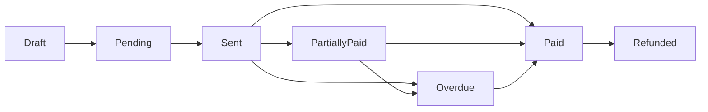

# Invoice Module

## Overview

The Invoice Module provides comprehensive invoice management with role-based access control, automated billing cycles, recurring invoices, bulk generation, and payment tracking integration.

## Features

### Core Capabilities

- **RBAC-Enhanced Operations**: Role-based permissions for all invoice actions
- **Invoice Lifecycle Management**: Draft → Pending → Sent → Partially Paid → Paid → Overdue
- **Recurring Invoices**: Template-based automatic generation
- **Bulk Invoice Generation**: Create invoices for multiple students at once
- **Payment Reminders**: Automated and manual reminder system
- **Credit Notes**: Support for refunds and adjustments
- **Double-Entry Integration**: Automatic journal entry creation
- **Multi-Currency Support**: Handle different currencies
- **Discounts & Scholarships**: Automatic application based on student profiles

### Dashboard Metrics

- Total invoices by status
- Collection rate and trends
- Outstanding amounts
- Overdue tracking
- Payment velocity

## Role-Based Access Control (RBAC)

### Permission Matrix

| Role       | View Own | View All | Create | Edit | Delete | Approve | Export |
| ---------- | -------- | -------- | ------ | ---- | ------ | ------- | ------ |
| DEVELOPER  | ✓        | ✓        | ✓      | ✓    | ✓      | ✓       | ✓      |
| ADMIN      | ✓        | ✓        | ✓      | ✓    | ✓      | ✓       | ✓      |
| ACCOUNTANT | ✓        | ✓        | ✓      | ✓    | -      | ✓       | ✓      |
| TEACHER    | ✓        | -        | -      | -    | -      | -       | -      |
| STUDENT    | ✓        | -        | -      | -    | -      | -       | -      |
| GUARDIAN   | ✓        | -        | -      | -    | -      | -       | -      |
| STAFF      | ✓        | -        | -      | -    | -      | -       | -      |

### Role-Specific Views

#### Admin & Accountant

- Full dashboard with all KPIs
- Bulk generation tools
- Recurring invoice management
- Payment reminder controls
- Export and reporting

#### Teachers & Staff

- View own salary invoices
- Download invoice PDFs
- View payment history

#### Students & Guardians

- View fee invoices
- Check payment status
- Download receipts
- View payment history

## Components

### Main Components

```
invoice/
├── content-enhanced.tsx    # Main invoice dashboard with RBAC
├── actions-enhanced.ts      # RBAC-aware server actions
├── bulk-generate.tsx        # Bulk invoice generation UI
├── recurring-template.tsx   # Recurring invoice templates
├── payment-reminder.tsx     # Payment reminder management
├── credit-note.tsx          # Credit note creation
├── columns.tsx              # Data table columns
├── table.tsx                # Invoice data table
├── form.tsx                 # Invoice creation/edit form
├── validation.ts            # Zod schemas
└── types.ts                 # TypeScript definitions
```

### Server Actions (actions-enhanced.ts)

#### RBAC-Enhanced CRUD

```typescript
getInvoicesWithRBAC(page, limit, filters) // Role-aware invoice fetching
createInvoiceWithRBAC(data) // Create with permission check
updateInvoiceWithRBAC(id, data) // Update with permission check
deleteInvoiceWithRBAC(id) // Delete with permission check
```

#### Bulk Operations

```typescript
generateBulkInvoices({
  invoiceType: "TUITION_FEE",
  targetGroup: "BY_CLASS",
  classIds: ["class1", "class2"],
  dueDate: new Date(),
  termId: "term1",
  sendNotifications: true,
})
```

#### Recurring Invoices

```typescript
createRecurringTemplate({
  name: "Monthly Tuition",
  frequency: "MONTHLY",
  dayOfMonth: 1,
  template: {...}
})
processRecurringInvoices()  // Run by cron job
```

#### Payment Reminders

```typescript
sendPaymentReminders({
  invoiceIds: ["inv1", "inv2"],
  includePastDue: true,
  reminderType: "EMAIL",
})
```

### `list-params.ts`

Search parameter configuration:

- Page and per-page pagination
- Invoice number, status, and client name filters
- Sorting state management

### `types.ts`

TypeScript types including:

- `InvoiceRow`: Data structure for table rows
- `Invoice`: Complete invoice model
- `Address` and `Item`: Supporting types

## Usage

The invoice component follows the established pattern used in the students component:

1. **Search Parameters**: Uses `nuqs` for URL-based state management
2. **Data Fetching**: Server-side data fetching with proper filtering
3. **Table Integration**: Uses the shared `DataTable` component with toolbar
4. **Modal System**: Integrates with the shared modal context for forms
5. **Toast Notifications**: Uses shared toast components for user feedback

## Search & Filter Capabilities

- **Invoice Number**: Text search with case-insensitive matching
- **Client Name**: Search by recipient/client name
- **Status**: Filter by invoice status (PAID, UNPAID, OVERDUE, CANCELLED)
- **Pagination**: Configurable page size and navigation
- **Sorting**: Sort by any column with proper state management

## Security Features

- Multi-tenant data isolation by `schoolId`
- User authentication validation
- Proper authorization checks for all operations
- Input validation with Zod schemas

## Integration

This component integrates with:

- Shared table components (`@/components/table/*`)
- Modal system (`@/components/atom/modal/*`)
- Toast notifications (`@/components/atom/toast`)
- Authentication system (`@/auth`)
- Database layer (Prisma with Neon Postgres)

## Architecture Status

### Current Structure

```
src/components/invoice/
├── dashboard/         # Invoice dashboard views
├── invoice/           # Invoice management features
├── onboarding/        # Invoice setup wizard
├── settings/          # Invoice settings
├── steps/             # Multi-step form components
├── actions/           # Server actions (legacy)
├── _component/        # Legacy components
├── actions.ts         # Main server actions
├── columns.tsx        # Table column definitions
├── content.tsx        # Main content component
├── form.tsx           # Invoice form components
├── table.tsx          # Data table implementation
├── types.ts           # TypeScript definitions
└── validation.ts      # Zod schemas
```

### Compliance Status

- ✅ **Server Actions**: Properly implemented with validation
- ✅ **Multi-tenant**: SchoolId scoping implemented
- ✅ **TypeScript**: Good type coverage
- ⚠️ **File Organization**: Mixed patterns and legacy folders
- ❌ **Standardization**: Inconsistent file structure
- ❌ **Testing**: No test coverage

## Critical Issues Found

### Code Organization Issues

- **Legacy folders**: `_component/` and `actions/` folders need cleanup
- **Duplicate logic**: Multiple invoice creation implementations
- **Mixed patterns**: Inconsistent between old and new approaches
- **File naming**: Not following kebab-case convention

### TypeScript Issues

- Some `any` type usage in actions
- Missing proper error types
- Incomplete type definitions for complex objects

### Performance Concerns

- Client-side filtering in some components
- Missing pagination optimization
- No caching strategy for frequently accessed data

## Technology Stack

- **Framework**: Next.js 15.4.4 App Router
- **UI**: ShadCN UI + Custom components
- **Forms**: React Hook Form + Zod
- **Tables**: @tanstack/react-table
- **Database**: Prisma ORM
- **Styling**: Tailwind CSS v4

## Development Guidelines

### Server Actions Pattern

```typescript
"use server"

import { auth } from "@/auth"

import { invoiceSchema } from "./validation"

export async function createInvoice(data: FormData) {
  const session = await auth()
  const schoolId = session?.user?.schoolId

  // Validate with Zod
  const validated = invoiceSchema.parse(Object.fromEntries(data))

  // Create with schoolId scope
  const invoice = await db.invoice.create({
    data: { ...validated, schoolId },
  })

  revalidatePath("/invoices")
  return { success: true, data: invoice }
}
```

### Form Implementation

```typescript
"use client"

import { useForm } from "react-hook-form"
import { zodResolver } from "@hookform/resolvers/zod"
import { invoiceSchema } from "./validation"

export function InvoiceForm() {
  const form = useForm({
    resolver: zodResolver(invoiceSchema),
    defaultValues: {
      // Invoice defaults
    }
  })

  return (
    <Form {...form}>
      {/* Form fields */}
    </Form>
  )
}
```

### Multi-step Forms

The invoice module uses a multi-step form pattern:

1. Basic Information
2. Client & Items
3. Review & Submit

Each step validates independently before proceeding.

## Required Improvements

### Immediate Actions

1. Clean up legacy folders (`_component/`, `actions/`)
2. Standardize file naming to kebab-case
3. Consolidate duplicate implementations
4. Add comprehensive TypeScript types
5. Implement proper error handling

### Performance Optimizations

1. Move filtering to server-side
2. Implement data caching
3. Add optimistic UI updates
4. Optimize bundle size

### Testing Requirements

1. Unit tests for calculations
2. Integration tests for workflows
3. E2E tests for invoice creation
4. Validation tests for forms

## API Endpoints

### Server Actions

- `getInvoicesWithFilters` - Fetch with search/filter
- `createInvoice` - Create new invoice
- `updateInvoice` - Update existing invoice
- `deleteInvoice` - Delete invoice
- `sendInvoiceEmail` - Email invoice to client
- `updateInvoiceStatus` - Update payment status

## Invoice Lifecycle



## Database Schema

### Main Tables

```prisma
model UserInvoice {
  id               String   @id @default(cuid())
  schoolId         String
  invoiceNumber    String
  userId           String   // Student/Parent/Staff
  type             InvoiceType
  status           InvoiceStatus
  amount           Decimal
  paidAmount       Decimal  @default(0)
  dueDate          DateTime
  termId           String?
  feeStructureId   String?
  isRecurring      Boolean  @default(false)
  templateId       String?
  items            Json
  notes            String?
  createdAt        DateTime @default(now())
  updatedAt        DateTime @updatedAt

  @@index([schoolId, status])
  @@index([schoolId, userId])
  @@index([schoolId, dueDate])
  @@unique([schoolId, invoiceNumber])
}

model InvoiceTemplate {
  id               String   @id @default(cuid())
  schoolId         String
  name             String
  description      String?
  frequency        RecurringFrequency
  dayOfMonth       Int?
  isActive         Boolean  @default(true)
  template         Json
  lastGenerated    DateTime?
  nextGeneration   DateTime?
  createdAt        DateTime @default(now())

  @@index([schoolId, isActive])
}

model InvoiceReminder {
  id               String   @id @default(cuid())
  schoolId         String
  invoiceId        String
  reminderType     ReminderType
  escalationLevel  Int      @default(1)
  sentAt           DateTime @default(now())
  sentTo           String
  status           String

  @@index([schoolId, invoiceId])
}
```

## Related Documentation

- [CLAUDE.md](../../../CLAUDE.md) - Architecture guidelines
- [Platform README](../platform/README.md)
- [Table Components](../table/README.md)
- [Form Patterns](../../docs/forms.md)

## Maintainers

Finance and billing team responsible for invoice features.

## License

MIT
